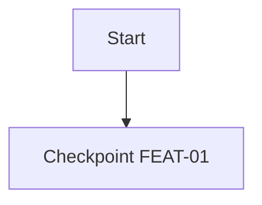

## Expedition Report

### Summary
<!-- Brief description of what trail was cleared -->

### Trail Map



### Checkpoint Status

| ID | Checkpoint | Status | Evidence |
|----|------------|--------|----------|
| FEAT-01 | Description | ✅ | [screenshot](./test-results/) |

### Coverage

- **Total Checkpoints:** X
- **Cleared:** X ✅
- **Blocked:** 0 ❌
- **Coverage:** 100%

### Expedition Log

#### Scout Phase
- [ ] Terrain surveyed (specs reviewed)
- [ ] Map charted (flow diagram created)
- [ ] Trail marked (tests written)
- [ ] Hazards identified (edge cases covered)

#### Builder Phase
- [ ] Trail cleared (all tests passing)
- [ ] No regressions (existing tests still pass)
- [ ] Code reviewed

### Evidence

- Playwright Report: `playwright-report/`
- Screenshots: `test-results/`
- Checkpoints: `test-results/checkpoints.json`

### Test Commands

```bash
# Run all tests
npx playwright test

# View report
npx playwright show-report

# Update coverage
npm run test:coverage
```

---
*Generated by [Pathfinder](https://github.com/srpadrono/Pathfinder) — Marks the trail before others follow.*
