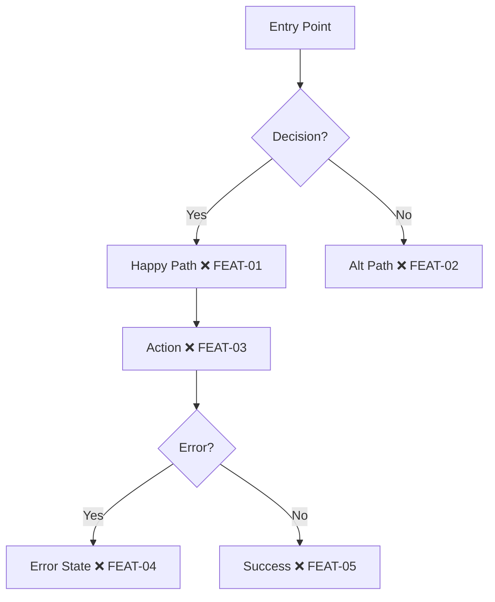

# AGENTS.md — Pathfinder Workflow

**Universal agent instructions for Test-Driven Development using the Pathfinder methodology.**

Works with any AI coding assistant: OpenClaw, Claude Code, Codex, Cursor, or direct LLM context.

---

## What is Pathfinder?

Pathfinder is a TDD workflow using an expedition metaphor:
- **Scouts** survey, chart maps, and write tests (❌ → 🔄)
- **Builders** implement features until tests pass (🔄 → ✅)

**Core insight:** Role separation enforces true test-first development.

**Philosophy:**
- **Test-Driven** — Write tests first, always
- **Systematic over ad-hoc** — Process over guessing
- **YAGNI ruthlessly** — Remove unnecessary features from all designs
- **Evidence over claims** — Verify before declaring success
- **Complexity reduction** — Simplicity as primary goal

---

## The Expedition Phases

### Phase 1: Survey the Terrain

**Goal:** Understand requirements through Socratic dialogue before any implementation.

**The Process:**

1. **Check project context first** — Read files, docs, recent commits
2. **Ask questions ONE AT A TIME** — Don't overwhelm
3. **Prefer multiple choice** — Easier to answer than open-ended
4. **Focus on:** Purpose, constraints, success criteria, edge cases

**Example questions:**
- "What happens if no data exists? (a) Show empty state (b) Redirect (c) Other"
- "Should state persist on refresh?"
- "How should API errors display? (a) Toast (b) Inline (c) Modal"
- "What's the expected behavior for invalid input?"

**Identify hazards:**
- Error states
- Empty states
- Loading states
- Edge cases
- Race conditions
- Authentication/authorization

**After surveying:**
- Propose 2-3 approaches with trade-offs
- Lead with your recommendation and reasoning
- Get sign-off before charting

### Phase 2: Chart the Map

**Goal:** Create visual journey diagram with all checkpoints marked.

**Present design in sections (200-300 words each).** Check after each: "Does this look right so far?"

Create Mermaid diagram in `USER-JOURNEYS.md`:



**Node format:** `[Description MARKER ID]`

**Checkpoint naming:** `{JOURNEY}-{NUMBER}` (AUTH-01, DASH-05, WELL-03)

**YAGNI check:** Before finalizing, ask: "Can any of these be removed?"

### Phase 3: Mark the Trail

**Goal:** Extract ALL checkpoints with categories and edge case matrix.

```typescript
const CHECKPOINTS = [
  { id: 'FEAT-01', category: 'Happy Path', description: 'Main flow works' },
  { id: 'FEAT-02', category: 'Alt Path', description: 'Alternative handled' },
  { id: 'FEAT-03', category: 'Action', description: 'User action succeeds' },
  { id: 'FEAT-04', category: 'Error', description: 'Error displayed correctly' },
  { id: 'FEAT-05', category: 'Success', description: 'Completion state shown' },
];
```

**Categories:** Happy Path, Error, Empty State, Edge Case, Action, Validation, Loading

**Edge Case Matrix:**

| Scenario | Expected | Checkpoint |
|----------|----------|------------|
| No data | Empty state | FEAT-06 |
| API timeout | Retry + error | FEAT-07 |
| Invalid input | Validation msg | FEAT-08 |
| Unauthorized | Redirect login | FEAT-09 |

**Commit:** Save map and checkpoints before scouting.

### Phase 4: Scout (Write Tests)

**Goal:** Write failing tests for ALL checkpoints before any implementation.

#### The Iron Law

```
NO PRODUCTION CODE WITHOUT A FAILING TEST FIRST
```

**Wrote code before the test? Delete it. Start over.**

No exceptions:
- Don't keep it as "reference"
- Don't "adapt" it while writing tests
- Don't look at it
- Delete means delete

#### RED-GREEN-REFACTOR

```
RED → Verify RED → GREEN → Verify GREEN → REFACTOR → Repeat
```

**RED - Write Failing Test:**
```typescript
import { TestRunner, Page, BASE } from '../scripts/run-tests';

const CHECKPOINTS = [
  {
    id: 'FEAT-01',
    journey: 'feature',
    description: 'Main flow works',
    fn: async (page: Page) => {
      await page.goto(`${BASE}/feature`);
      const heading = page.locator('h1');
      if (!(await heading.isVisible())) {
        throw new Error('Expected heading not visible');
      }
    },
  },
];

new TestRunner().run(CHECKPOINTS);
```

**Verify RED (MANDATORY):**
```bash
npx tsx e2e/test-{feature}.ts
```
- Confirm test FAILS (not errors)
- Confirm failure message is expected
- Confirm fails because feature missing, not typos

**After writing tests:**
1. Update diagram markers: ❌ → 🔄
2. Run tests to confirm they ALL fail
3. Commit: `"Scout: Mark trail for FEAT-01 through FEAT-05"`

#### Testing Anti-Patterns

| Anti-Pattern | Problem | Instead |
|--------------|---------|---------|
| Test passes immediately | Doesn't test new behavior | Ensure it fails first |
| Vague test name | "test1", "it works" | Describe specific behavior |
| Testing mocks not code | Proves nothing | Test real behavior |
| Multiple assertions | Hard to debug | One behavior per test |
| Implementation details | Brittle | Test outcomes, not internals |

### Phase 5: Build (Implement)

**Goal:** Implement minimal code to pass each test, one at a time.

#### Minimal Code Principle

Write the **simplest code** to make the test pass.

<Good>
```typescript
function validateEmail(email: string): boolean {
  return email.includes('@');  // Simplest that works
}
```
</Good>

<Bad>
```typescript
function validateEmail(email: string, options?: {
  allowSubdomains?: boolean;
  checkMX?: boolean;  // YAGNI
}): boolean { ... }
```
</Bad>

Don't add features, refactor other code, or "improve" beyond the test.

#### The Build Loop

```bash
# Run tests repeatedly
npx tsx e2e/test-{feature}.ts
```

For each checkpoint:
1. Run test → watch it FAIL (already red from Scout)
2. Write minimal code to pass
3. Run test → watch it PASS
4. Update diagram: 🔄 → ✅
5. Take screenshot evidence
6. Commit: `"Builder: Clear FEAT-01"`

**Verification Before Completion:**
- All tests pass
- No console errors/warnings
- Screenshots captured
- Evidence matches expected behavior

#### If Tests Need Fixing

**STOP.** You're back in Scout mode.

1. Explicitly switch: "Entering Scout mode to fix test"
2. Fix test assertion
3. Watch it fail correctly
4. Switch back: "Entering Builder mode"
5. Continue implementation

Never blur the boundary.

### Phase 6: Dispatch (Multi-Agent)

**Goal:** Coordinate Scout and Builder agents efficiently.

#### Fresh Context Principle

Each dispatched agent starts fresh. No context pollution from previous tasks.

#### Two-Stage Review

After each task, review in order:
1. **Spec Compliance** — Does code match checkpoint requirements?
2. **Code Quality** — Is code clean, tested, minimal?

#### Single-Agent Mode

One agent handles both roles sequentially:

1. **Scout phase first** — Write ALL tests before implementing
2. **Commit scout work** — Save tests and map
3. **Switch to Builder** — Implement without changing tests
4. **If tests need fixing** — Switch back to Scout explicitly

Never blur the boundary. Complete one role before switching.

#### Multi-Agent Mode

**OpenClaw:**
```typescript
sessions_spawn({
  task: `Scout: Read USER-JOURNEYS.md, write tests for FEAT-01 through FEAT-05.
         Territory: e2e/ only. Do not modify src/.
         Commit when done, then handoff to @builder.`,
  label: "scout-feature"
});

sessions_spawn({
  task: `Builder: Read USER-JOURNEYS.md, clear trail for FEAT-01 through FEAT-05.
         Territory: src/ only. Do not modify test assertions.
         Run: npx tsx e2e/test-feature.ts`,
  label: "builder-feature"
});
```

**Claude Code / Codex:**
- Run Scout and Builder in separate sessions
- Coordinate via `USER-JOURNEYS.md` file
- Use explicit @scout/@builder mentions

#### Handoff Protocol

**Scout → Builder:**
```
@builder — Trail marked for FEAT-01 through FEAT-05.
Tests in e2e/test-feature.ts. Map in USER-JOURNEYS.md.
Run: npx tsx e2e/test-feature.ts
All tests should FAIL (expected).
```

**Builder → Scout:**
```
@scout — Trail cleared. All checkpoints passing.
Evidence: /tmp/test-screenshots/feature/
Ready for expedition report.
```

### Phase 7: Report (Expedition Report)

**Goal:** Create PR with evidence, map, and review checklist.

#### Pre-Review Checklist

Before requesting review, verify:
- [ ] All tests pass
- [ ] Trail map updated (all ✅)
- [ ] Screenshots captured
- [ ] No console errors
- [ ] Code matches spec
- [ ] YAGNI applied (no extra features)

#### Issue Severity

| Severity | Action | Examples |
|----------|--------|----------|
| **Critical** | Block merge, fix immediately | Tests fail, security issue, data loss |
| **Important** | Fix before merge | Missing error handling, poor UX |
| **Minor** | Note for later | Magic numbers, naming nitpicks |

**Critical issues block progress.** No exceptions.

#### PR Template

Use `assets/PR_TEMPLATE.md`:

1. **Trail Map** — Final Mermaid diagram (all ✅)
2. **Checkpoint Table** — ID, description, status, evidence link
3. **Edge Cases Covered** — Matrix from Phase 3
4. **Evidence** — Screenshot links
5. **Expedition Log** — What was built, decisions made, issues encountered

---

## Trail Markers

| Marker | Name | Meaning |
|--------|------|---------|
| ❌ | Uncharted | Checkpoint identified, no test yet |
| 🔄 | Scouted | Test written, awaiting implementation |
| ✅ | Cleared | Test passing |
| ⚠️ | Unstable | Flaky test needs attention |
| ⏭️ | Skipped | Out of scope for this expedition |

---

## Role Separation

### Scout Role

**Responsibilities:**
- Survey terrain (analyze requirements, Socratic questions)
- Chart maps (create Mermaid diagrams)
- Mark trails (define checkpoints, edge case matrix)
- Write tests (❌ → 🔄)

**Territory:** `e2e/`, `USER-JOURNEYS.md`, test files

**Forbidden:** Modifying `src/` (implementation code)

### Builder Role

**Responsibilities:**
- Follow marked trail (no deviation)
- Implement minimal code (🔄 → ✅)
- Collect evidence (screenshots)
- Verify before completion

**Territory:** `src/`, implementation code

**Forbidden:** Modifying test assertions

---

## File Locations

| File | Purpose |
|------|---------|
| `USER-JOURNEYS.md` | Trail maps for all journeys |
| `e2e/test-*.ts` | Test files |
| `scripts/run-tests.ts` | Test runner with evidence collection |
| `scripts/setup-auth.ts` | Authentication state setup |
| `scripts/update-coverage.ts` | Sync results to trail maps |
| `assets/PR_TEMPLATE.md` | Expedition report template |

---

## Quick Reference

**Start a new journey:**
1. Survey → Socratic questions, one at a time
2. Chart → Mermaid diagram with ❌, present in sections
3. Mark → Checkpoint list + edge case matrix
4. Scout → Write ALL tests, verify they FAIL, update to 🔄
5. Build → Minimal code, one test at a time, update to ✅
6. Dispatch → Fresh context, two-stage review
7. Report → PR with evidence, severity-based issues

**Run tests:**
```bash
npx tsx e2e/test-{feature}.ts
```

**Key principles:**
- Tests exist before implementation. Always.
- Wrote code before test? Delete it.
- One question at a time. One test at a time.
- YAGNI ruthlessly. Minimal code only.
- Critical issues block progress.

---

## Environment Setup

Create `.env.local`:
```bash
TEST_EMAIL=test@example.com
TEST_PASSWORD=your-test-password
BASE_URL=http://localhost:3000
```

**Never commit credentials.** Use environment variables.
