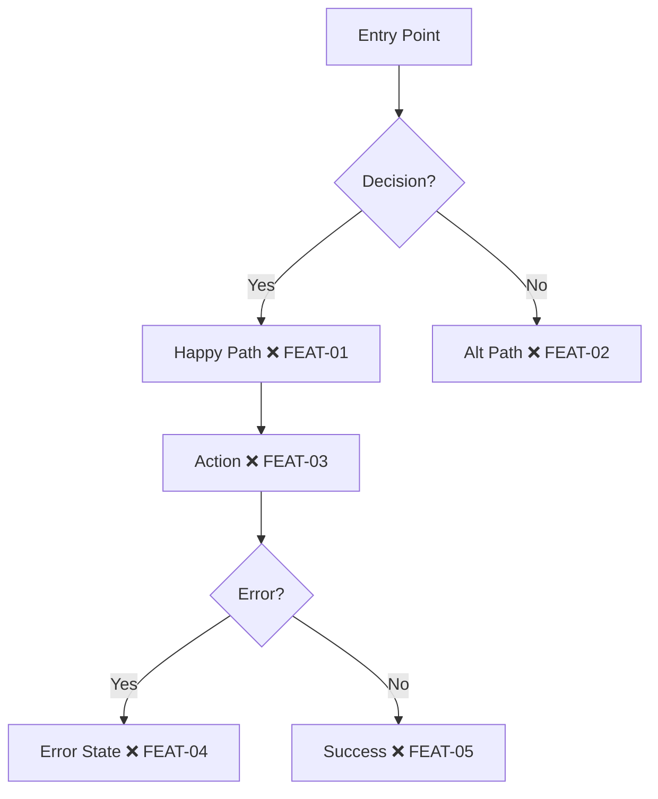

# AGENTS.md — Pathfinder Workflow

**Universal agent instructions for Test-Driven Development using the Pathfinder methodology.**

This file works with any AI coding assistant: OpenClaw, Claude Code, Codex, Cursor, or direct LLM context.

---

## What is Pathfinder?

Pathfinder is a TDD workflow using an expedition metaphor:
- **Scouts** survey, chart maps, and write tests (❌ → 🔄)
- **Builders** implement features until tests pass (🔄 → ✅)

The key insight: **role separation enforces true test-first development**.

---

## The Expedition Phases

### Phase 1: Survey the Terrain

When given a feature request:

1. Review all requirements carefully
2. Identify hazards (edge cases, errors, empty states)
3. Ask clarifying questions before proceeding

**Example questions:**
- "What happens if no data exists?"
- "Should state persist on refresh?"
- "How should API errors be displayed?"
- "What's the expected behavior for invalid input?"

### Phase 2: Chart the Map

Create a Mermaid diagram showing the user journey:



**Node format:** `[Description MARKER ID]`

**Checkpoint naming:** `{JOURNEY}-{NUMBER}` (e.g., AUTH-01, DASH-05, WELL-03)

### Phase 3: Mark the Trail

Extract ALL checkpoints from the diagram into a structured list:

```typescript
const CHECKPOINTS = [
  { id: 'FEAT-01', category: 'Happy Path', description: 'Main flow works' },
  { id: 'FEAT-02', category: 'Alt Path', description: 'Alternative handled' },
  { id: 'FEAT-03', category: 'Action', description: 'User action succeeds' },
  { id: 'FEAT-04', category: 'Error', description: 'Error displayed' },
  { id: 'FEAT-05', category: 'Success', description: 'Completion state shown' },
];
```

**Categories:** Happy Path, Error, Empty State, Edge Case, Action, Validation

### Phase 4: Scout (Write Tests)

Write failing tests for each checkpoint:

```typescript
import { TestRunner, Page, BASE } from '../scripts/run-tests';

const CHECKPOINTS = [
  {
    id: 'FEAT-01',
    journey: 'feature',
    description: 'Main flow works',
    fn: async (page: Page) => {
      await page.goto(`${BASE}/feature`);
      const heading = page.locator('h1');
      if (!(await heading.isVisible())) {
        throw new Error('Expected heading not visible');
      }
    },
  },
  // ... more checkpoints
];

new TestRunner().run(CHECKPOINTS);
```

**After writing tests:**
1. Update diagram markers: ❌ → 🔄
2. Run tests to confirm they fail (expected)
3. Commit: `"Scout: Mark trail for FEAT-01 through FEAT-05"`

### Phase 5: Build (Implement)

Implement features until all tests pass:

```bash
# Run tests repeatedly during implementation
npx tsx e2e/test-{feature}.ts
```

**As each test passes:**
1. Update diagram markers: 🔄 → ✅
2. Take screenshot evidence
3. Continue to next checkpoint

**After all tests pass:**
1. Commit: `"Builder: Clear trail for FEAT-01 through FEAT-05"`
2. Run coverage update: `npx tsx scripts/update-coverage.ts`

### Phase 6: Expedition Report (PR)

Create PR using the template in `assets/PR_TEMPLATE.md`:

1. **Trail Map** — Final Mermaid diagram (all ✅)
2. **Checkpoint Table** — ID, description, status
3. **Evidence** — Screenshot links
4. **Expedition Log** — What was built, decisions made

---

## Trail Markers

| Marker | Name | Meaning |
|--------|------|---------|
| ❌ | Uncharted | Checkpoint identified, no test yet |
| 🔄 | Scouted | Test written, awaiting implementation |
| ✅ | Cleared | Test passing |
| ⚠️ | Unstable | Flaky test needs attention |
| ⏭️ | Skipped | Out of scope for this expedition |

---

## Role Separation

### Scout Role

**Responsibilities:**
- Survey terrain (analyze requirements)
- Chart maps (create Mermaid diagrams)
- Mark trails (define checkpoints)
- Write tests (❌ → 🔄)

**Territory:** `e2e/`, `USER-JOURNEYS.md`, test files

**Forbidden:** Modifying `src/` (implementation code)

### Builder Role

**Responsibilities:**
- Follow marked trail
- Implement features (🔄 → ✅)
- Collect evidence (screenshots)

**Territory:** `src/`, implementation code

**Forbidden:** Modifying test assertions

### Handoff Protocol

**Scout → Builder:**
```
@builder — Trail marked for FEAT-01 through FEAT-05.
Tests in e2e/test-feature.ts. Map in USER-JOURNEYS.md.
Run: npx tsx e2e/test-feature.ts
```

**Builder → Scout:**
```
@scout — Trail cleared. All checkpoints passing.
Evidence: /tmp/test-screenshots/feature/
Ready for expedition report.
```

---

## Single-Agent Mode

When one agent handles both roles:

1. **Scout phase first** — Write ALL tests before implementing
2. **Commit scout work** — Save tests and map
3. **Switch to Builder** — Implement without changing tests
4. **If tests need fixing** — Switch back to Scout role explicitly

Never blur the boundary. Complete one role before switching.

---

## Multi-Agent Mode

For parallel development:

**OpenClaw:**
```typescript
sessions_spawn({
  task: "Clear trail for FEAT-01 through FEAT-05",
  label: "builder-feature"
});
```

**Claude Code / Codex:**
- Run Scout and Builder in separate sessions
- Coordinate via `USER-JOURNEYS.md` file
- Use explicit @scout/@builder mentions

---

## File Locations

| File | Purpose |
|------|---------|
| `USER-JOURNEYS.md` | Trail maps for all journeys |
| `e2e/test-*.ts` | Test files |
| `scripts/run-tests.ts` | Test runner with evidence collection |
| `scripts/setup-auth.ts` | Authentication state setup |
| `scripts/update-coverage.ts` | Sync results to trail maps |
| `assets/PR_TEMPLATE.md` | Expedition report template |

---

## Test File Template

```typescript
import { TestRunner, Page, BASE } from '../scripts/run-tests';

// Checkpoints for this journey
const CHECKPOINTS = [
  {
    id: 'JOURNEY-01',
    journey: 'journey-name',
    description: 'What this checkpoint verifies',
    fn: async (page: Page) => {
      // Navigate
      await page.goto(`${BASE}/path`);
      
      // Assert
      const element = page.locator('[data-testid="target"]');
      if (!(await element.isVisible())) {
        throw new Error('Expected element not found');
      }
      
      // Interact (if needed)
      await element.click();
      
      // Verify result
      const result = page.locator('[data-testid="result"]');
      if (!(await result.isVisible())) {
        throw new Error('Expected result not visible');
      }
    },
  },
];

new TestRunner().run(CHECKPOINTS);
```

---

## Environment Setup

Create `.env.local`:
```bash
TEST_EMAIL=test@example.com
TEST_PASSWORD=your-test-password
BASE_URL=http://localhost:3000
```

**Never commit credentials.** Use environment variables.

---

## Quick Reference

**Start a new journey:**
1. Survey → Ask clarifying questions
2. Chart → Create Mermaid diagram with ❌ markers
3. Mark → List all checkpoints
4. Scout → Write tests, update to 🔄
5. Build → Implement, update to ✅
6. Report → Create PR with evidence

**Run tests:**
```bash
npx tsx e2e/test-{feature}.ts
```

**Update coverage:**
```bash
npx tsx scripts/update-coverage.ts
```

**Key principle:** Tests exist before implementation. Always.
