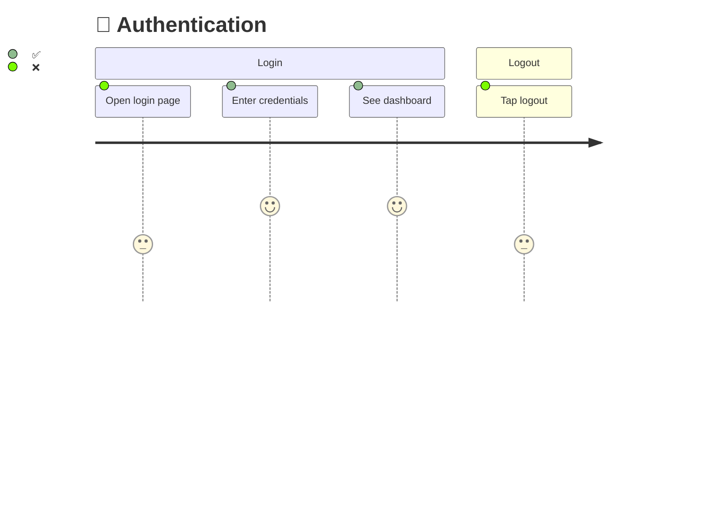

# Pathfinder

Map every user journey in your codebase. See what's tested. Fill the gaps.

## What It Does

```
/map → /diagram → /scout → /verify
```

1. **Map** — Deep dives into your code to discover every user journey (routes, screens, interactions)
2. **Diagram** — Generates Mermaid journey diagrams showing ✅ tested and ❌ untested steps
3. **Scout** — Generates UI tests for untested steps using the correct framework
4. **Verify** — Runs tests, updates diagrams ❌→✅, computes coverage score



**Supported frameworks:** Playwright, Cypress, Maestro, Detox, XCUITest, Espresso, Flutter.

## Quick Start

```bash
git clone https://github.com/srpadrono/Pathfinder.git ~/.pathfinder
cd your-project
python3 ~/.pathfinder/scripts/pathfinder-init.py
```

Then tell your AI agent: `/map`

## How It Works

Pathfinder scans your codebase for routes, screens, and navigation patterns. It groups them into user journeys and checks which steps have existing test coverage. The result is a `journeys.json` file that powers everything:

```json
{
  "journeys": [{
    "id": "AUTH",
    "name": "Authentication",
    "steps": [
      { "id": "AUTH-01", "action": "Open login page", "screen": "/login", "tested": false },
      { "id": "AUTH-02", "action": "Enter credentials", "screen": "/login", "tested": true }
    ]
  }]
}
```

The diagram generator turns this into Mermaid visuals. The test generator creates framework-correct skeletons. Every test you write flips ❌→✅.

## Coverage Score

```bash
python3 scripts/coverage-score.py .pathfinder/journeys.json
```

| Coverage | Status |
|----------|--------|
| 🟢 80%+ | Excellent |
| 🟡 50-79% | Acceptable |
| 🔴 <50% | Keep scouting |

## Structure

```
skills/
  mapping/           # Discover user journeys
  diagramming/       # Generate Mermaid coverage diagrams
  scouting/          # Write tests for ❌ steps
  ui-testing/        # Framework detection + test generation
    references/      # Playwright, Cypress, Maestro, Detox, XCUITest, Espresso, Flutter
  verifying/         # Run tests, update diagrams, coverage score
  using-pathfinder/  # Entry point
scripts/             # pathfinder-init.py, coverage-score.py
```

## Requirements

- Python 3
- Git
- A UI test framework (auto-detected)

## License

MIT
