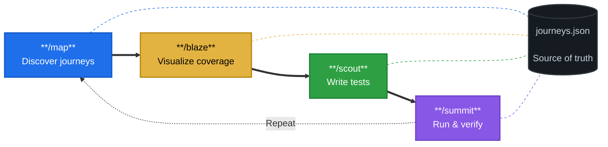
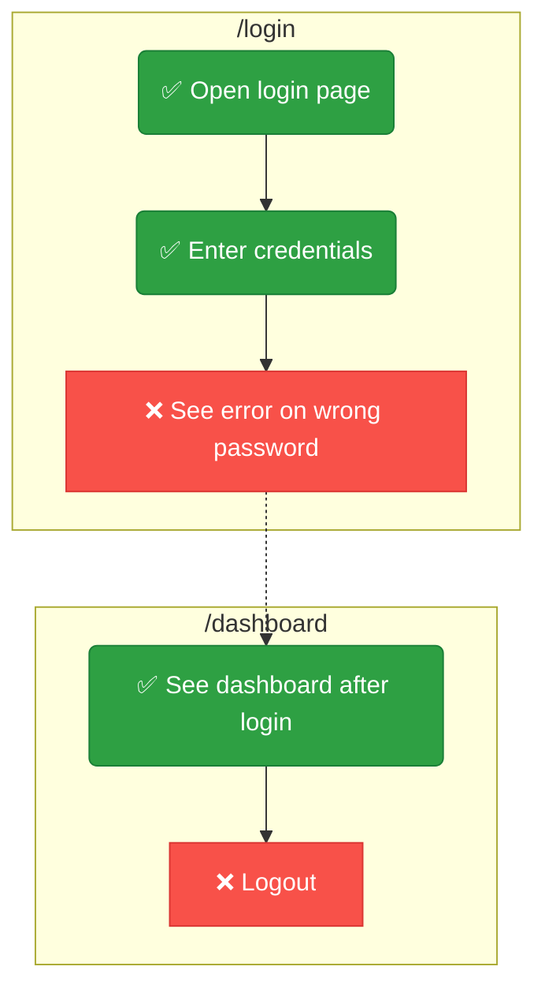
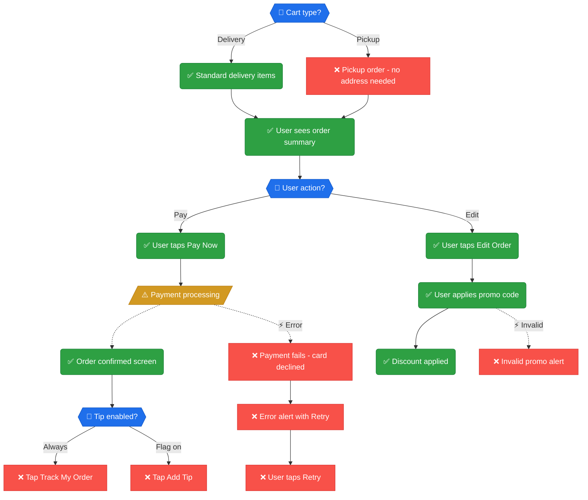
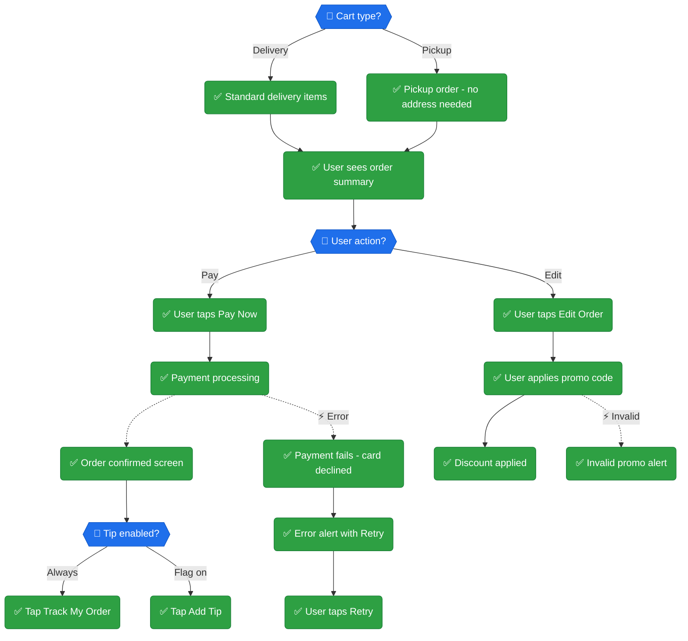

<div align="center">

# 🧭 Pathfinder

### Map every user journey. See what's tested. Fill the gaps.

An AI-agent skill that discovers user journeys in any codebase, visualizes test coverage with interactive Mermaid diagrams, and generates framework-correct UI tests to close the gaps.

[](LICENSE)
[](https://python.org)
[](tests/)
[](https://agentskills.io)

**Works with:** Claude Code (plugin) · Codex · Gemini CLI · Cursor

[Installation](#-installation) · [How It Works](#-how-it-works) · [Supported Frameworks](#-supported-frameworks) · [Commands](#-commands)

</div>

---

## 🎯 The Problem

You have tests. But can you answer: **"Which user journeys are actually covered?"**

Line coverage says 78%. But can a user sign up, upload a file, and view the result end-to-end? Nobody knows. There's no map.

**Pathfinder fixes this.** It crawls your codebase, discovers every user journey, and produces a **living coverage map** — so you can see exactly where the gaps are and fill them systematically.


https://github.com/user-attachments/assets/0d42691c-98a1-4f2a-a27c-a4f0e5980ea6


---

## 🔍 How It Works

Pathfinder runs in **four phases**, each named after trail exploration:

<table>
<tr>
<td width="25%" align="center">

### 🗺️ Map
**Discover the terrain**

Deep dives into routes, screens, components, and API calls. Groups them into user journeys. Checks which steps already have tests.

</td>
<td width="25%" align="center">

### 🔥 Blaze
**Mark the trail**

Generates Mermaid flowcharts with **✅** tested and **❌** untested markers. Produces a coverage summary table.

</td>
<td width="25%" align="center">

### 🔭 Scout
**Explore the gaps**

Generates framework-correct test skeletons for every ❌ step. Appends to existing files or creates new ones matching your patterns.

</td>
<td width="25%" align="center">

### ⛰️ Summit
**Reach the peak**

Runs all tests, reconciles results, updates the diagrams, and computes a coverage score. ❌ → ✅

</td>
</tr>
</table>



The cycle repeats. New code → `/map` → new ❌ steps → `/scout` → `/summit`. The diagram always reflects reality.

---

## 📊 What You Get

### Journey Flowcharts

Every user journey becomes a visual flowchart — green = tested, red = gap:



### Coverage Table

```
| Journey            | Steps | Tested | Coverage    |
|--------------------|-------|--------|-------------|
| 🔐 Authentication  | 5     | 3      | 🟡 60.0%   |
| 📤 File Upload     | 8     | 0      | 🔴 0.0%    |
| 📄 Reports         | 12    | 7      | 🟡 58.3%   |
| 💬 Chat            | 6     | 6      | 🟢 100.0%  |
| **Total**          | **31**| **16** | **51.6%**   |
```

### Coverage Score

| Score | Status | Meaning |
|-------|--------|---------|
| 🟢 **80%+** | Excellent | Ship it |
| 🟡 **50–79%** | Acceptable | Document the gaps |
| 🔴 **<50%** | Insufficient | Keep scouting |

---

## 🏪 Example

Here's Pathfinder on a **food delivery app's checkout module** — 5 journeys, 28 steps, taken from 52% to 100% coverage in one session.

### 📸 Before (52%)



### 🚀 After (100%)



### 📊 Coverage Delta

| Journey | Before | After | Delta |
|---------|--------|-------|-------|
| 🛒 Checkout (Pay) | 50% | 100% | +3 steps |
| ✏️ Edit Order (Promo) | 75% | 100% | +1 step |
| 🚗 Pickup variant | 0% | 100% | +1 step |
| 💳 Payment errors | 0% | 100% | +3 steps |
| 💰 Tip feature flag | 0% | 100% | +1 step |
| **Total** | **52%** | **✅ 100%** | **+9 steps, 22 tests** |

> All generated in one `/map` → `/blaze` → `/scout` → `/summit` session.

---

## 🛠️ Supported Frameworks

Pathfinder **auto-detects** your UI test framework and generates tests with the correct selectors, waits, and patterns:

| Framework | Platform | Selectors | Auto-detected from |
|-----------|----------|-----------|-------------------|
| **Playwright** | Web | `getByRole`, `getByTestId` | `playwright.config.ts` |
| **Cypress** | Web | `cy.get('[data-cy=]')` | `cypress.config.ts` |
| **Maestro** | Mobile | `id:`, `text:` | Expo `app.json` |
| **Detox** | React Native | `by.id()`, `by.label()` | `.detoxrc.js` |
| **XCUITest** | iOS | `app.buttons[""]` | `.xcodeproj` |
| **Espresso** | Android | `withId()`, `withText()` | `build.gradle` |
| **Flutter** | Flutter | `find.byKey()` | `integration_test/` |

Each framework has a dedicated reference guide with selector strategies, wait patterns, and test templates — loaded only when needed.

---

## 🧠 Smart Test Generation

The test generator adapts to **your project's existing patterns**:

```bash
# Auto-detect: appends to existing auth.spec.ts or creates new file
python3 ~/.agents/skills/pathfinder/scripts/generate-ui-test.py \
  AUTH-05 "Logout redirects to login" playwright --route /dashboard --auto
```

| Feature | How it works |
|---------|-------------|
| **Auto-append** | Finds existing journey file → inserts inside `test.describe()` block |
| **Auto-create** | No existing file → creates with proper imports, describe wrapper, auth setup |
| **Test directory** | Reads from `playwright.config.ts` / `cypress.config.ts` — no hardcoded paths |
| **Auth detection** | Detects `storageState` pattern and includes authenticated setup |
| **Selectors** | Accessibility-first: `getByRole` > `getByTestId` > `getByText` > CSS (last resort) |
| **Waits** | Condition-based only: `waitForLoadState`, `waitForExistence` — never `sleep()` |
| **Visual regression** | Screenshot baseline capture + pixel-level diff comparison |

---

## ⚙️ Configurable

Drop a `pathfinder/config.json` to tune behavior — it's schema-backed, so editors autocomplete every option:

```json
{
  "$schema": "https://raw.githubusercontent.com/srpadrono/Pathfinder/main/skills/pathfinder/schema/config.schema.json",
  "framework": "playwright",
  "testDir": "e2e/tests",
  "coverage": { "thresholds": { "excellent": 90, "acceptable": 60 }, "failUnder": 80, "countPartialAsTested": true },
  "ignore": ["**/admin/**", "**/legacy/**"],
  "commands": { "test": "npx playwright test --reporter=line" },
  "selectors": { "strategy": "testid-first", "testIdAttribute": "data-test" }
}
```

| Option | Effect |
|--------|--------|
| `coverage.thresholds` | 🟢/🟡/🔴 cutoffs used by the score and diagrams |
| `coverage.failUnder` | Make `coverage-score.py` exit non-zero below N% — a CI gate |
| `coverage.countPartialAsTested` | Count `partial` steps toward coverage |
| `ignore` | Globs to skip when crawling code and scanning tests |
| `commands.test` | The exact command Summit runs for the suite |
| `selectors` | Selector strategy + test-id attribute for generated tests |

Both `config.json` and `journeys.json` ship [JSON Schemas](skills/pathfinder/schema/) for validation and autocomplete. No config? Everything auto-detects.

---

## 🧪 Evaluated, not hand-waved

Pathfinder ships a real, **honest** eval suite — modeled on [Anthropic's skill-creator](https://github.com/anthropics/skills) and [OpenAI's skill-eval](https://developers.openai.com/blog/eval-skills) methodology. Two axes:

- **Output quality** — every case runs **A/B** (with the skill vs. a plain agent), graded by an **LLM judge** (no partial credit, every verdict cites an artifact), across multiple runs for **mean ± stddev** and **skill lift**. The aggregator automatically flags assertions that *don't* discriminate skill value.
- **Triggering** — 20 queries (half deliberate near-misses) check the skill fires when it should and stays quiet on unit-test / API / line-coverage asks, with a held-out test split.

```bash
npm run eval:validate    # schema + structure (CI, no model)
npm run eval:run && npm run eval:grade && npm run eval:benchmark   # full A/B (needs claude CLI)
npm run eval:trigger     # triggering accuracy / precision / recall
```

No grader is rigged to pass. See **[evals/README.md](evals/README.md)** and a real run in **[evals/SAMPLE_RESULTS.md](evals/SAMPLE_RESULTS.md)**. A description optimizer (`evals/scripts/run_loop.py`) tunes triggering against a held-out split.

---

## 🔌 Also an MCP server

Beyond the skill, Pathfinder's deterministic tools (`detect_ui_framework`, `coverage_score`, `validate_journeys`, `generate_diagrams`, `scan_test_coverage`) are exposed via a dependency-free **MCP server** — usable from any MCP client. It's auto-registered with the Claude Code plugin and reuses the exact same scripts. See **[mcp/README.md](mcp/README.md)**.

---

## 📦 Installation

Pick whichever fits your agent. All install the same skills.

### Any agent — one command (recommended)

Works with Claude Code, Codex, Gemini, Cursor, and more via the universal [`skills`](https://agentskills.io) installer. It asks which agents to install into and whether to scope to one project or all of them:

```bash
npx skills add https://github.com/srpadrono/Pathfinder
```

> No `npx`? Install Node first: `brew install node` (macOS) — and if *that* fails, install [Homebrew](https://brew.sh). Then re-run the command.

### Claude Code — native plugin marketplace

```text
/plugin marketplace add srpadrono/Pathfinder
/plugin install pathfinder@pathfinder
```

### Self-contained installer (no Node required)

Clones to `~/.agents/pathfinder`, symlinks the skills into `~/.agents/skills/` (where both Claude Code and **Codex** auto-discover them), and registers the Claude Code plugin:

```bash
bash <(curl -fsSL https://raw.githubusercontent.com/srpadrono/Pathfinder/main/install/install.sh)
```

Supports `update`, `uninstall`, and `--version`. **Or just clone it and use it however you want.** See **[docs/installation.md](docs/installation.md)** for details and troubleshooting.

---

## 💻 Commands

### Agent Commands

| Command | What happens |
|---------|-------------|
| `/map` | Discover all user journeys in the codebase |
| `/blaze` | Generate Mermaid flowcharts |
| `/scout` | Write UI tests for untested steps |
| `/summit` | Run tests, update diagrams, compute score |

---

## 📁 Project Structure

**`~/.agents/pathfinder/`** (repo clone)

| Path | Purpose |
|------|---------|
| `.claude-plugin/` | Plugin + marketplace manifest (`plugin.json`, `marketplace.json`) |
| `AGENTS.md` | Cross-agent contributor instructions ([open standard](https://agents.md)) |
| `skills/pathfinder/` | Main skill — auto-triggers on coverage questions |
| `skills/pathfinder/SKILL.md` | Entry point |
| `skills/pathfinder/references/` | 8 framework + testing reference docs |
| `skills/pathfinder/scripts/` | 9 Python CLIs + 2 shared helpers |
| `skills/pathfinder/schema/` | JSON Schemas for `config.json` + `journeys.json` |
| `skills/pathfinder/agents/` | Codex presentation metadata (`openai.yaml`) |
| `skills/pathfinder/assets/` | Starter templates |
| `skills/map/`, `blaze/`, `scout/`, `summit/` | `/map`, `/blaze`, `/scout`, `/summit` command skills |
| `evals/` | Honest A/B + triggering eval harness + description optimizer |
| `mcp/` | MCP server exposing the deterministic tools to any MCP client |
| `scripts/` | Repo tooling (skill-frontmatter validator) |
| `install/` | Self-contained installer |
| `tests/` | 99 self-tests |
| `.githooks/` | pre-commit, post-commit, pre-push |

**`~/.agents/skills/`** (symlinks)

| Symlink | Target |
|---------|--------|
| `pathfinder` | `~/.agents/pathfinder/skills/pathfinder` |
| `map` | `~/.agents/pathfinder/skills/map` |
| `blaze` | `~/.agents/pathfinder/skills/blaze` |
| `scout` | `~/.agents/pathfinder/skills/scout` |
| `summit` | `~/.agents/pathfinder/skills/summit` |

---

## 🔗 Git Hooks

Enable with: `git config core.hooksPath ~/.agents/pathfinder/.githooks`

| Hook | What it does |
|------|-------------|
| **pre-commit** | Validates `journeys.json` is valid JSON |
| **post-commit** | Auto-regenerates diagrams when `journeys.json` changes |
| **pre-push** | Blocks direct push to `main` / `master` |

---

## 📋 Requirements

| Requirement | Purpose |
|-------------|---------|
| **Python 3** | Runs all scripts |
| **Git** | Version control for journey maps |
| **UI test framework** | Auto-detected, or specify in config |
| **Pillow** *(optional)* | Pixel-level visual regression |

---

## 📄 License

MIT License — see [LICENSE](LICENSE) for details.

Copyright (c) 2026 Sergio Padron and [Pathfinder contributors](https://github.com/srpadrono/Pathfinder/graphs/contributors).

---

<div align="center">

**Map the terrain. Blaze the markers. Scout the gaps. Reach the summit.**

🗺️ → 🔥 → 🔭 → ⛰️

[Get Started](#-installation) · [View on GitHub](https://github.com/srpadrono/Pathfinder)

</div>
