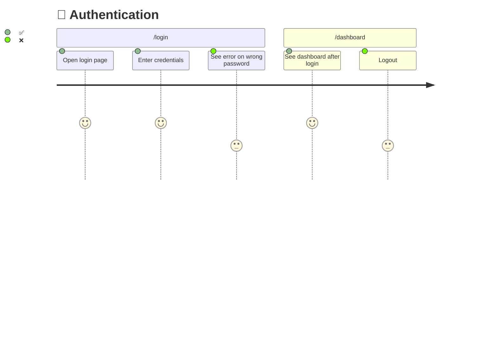

<div align="center">

# 🧭 Pathfinder

**Map your user journeys. Blaze the trail. Scout the gaps. Reach the summit.**

An AI-powered UI test coverage tool that discovers every user journey in your codebase,
visualizes what's tested vs untested, and generates the missing tests — for any tech stack.

[](LICENSE)
[](https://python.org)
[](tests/)

</div>

---

## The Problem

Your codebase has tests, but you can't answer: *"Which user journeys are actually covered?"*

Line coverage says 78%. But can a user log in, upload a file, and view the result? Nobody knows — there's no map.

## The Solution

Pathfinder crawls your codebase, maps every user journey, and produces a living coverage diagram:



```
| Journey          | Steps | Tested | Coverage   |
|------------------|-------|--------|------------|
| 🔐 Auth          | 5     | 3      | 🟡 60%    |
| 📤 Upload        | 8     | 0      | 🔴 0%     |
| 📄 Reports       | 12    | 7      | 🟡 58%    |
| Total            | 25    | 10     | 40%        |
```

Every test you write flips an ❌ to ✅. Progress is visible.

---

## Quick Start

```bash
# Install
git clone https://github.com/srpadrono/Pathfinder.git ~/.pathfinder

# Initialize in your project
cd your-project
python3 ~/.pathfinder/scripts/pathfinder-init.py

# Start mapping
```

**Works with:** Claude Code · Codex · OpenClaw · Cursor · Windsurf · Aider · any agent that reads markdown.

See **[Installation Guide](docs/installation.md)** for setup instructions per platform.

---

## The Four Phases

### 🗺️ `/map` — Discover the terrain

Pathfinder deep dives into your codebase — reading routes, screens, components, API calls, and navigation patterns. It groups them into user journeys and checks which steps already have tests.

**Output:** `.pathfinder/journeys.json` — structured map of every journey with per-step coverage.

### 🔥 `/blaze` — Mark the trail

Transforms the journey map into Mermaid diagrams with ✅ (tested) and ❌ (untested) markers. Generates a coverage summary table with per-journey percentages.

**Output:** `.pathfinder/diagrams.md` — auto-regenerated whenever journeys.json changes.

### 🔭 `/scout` — Explore the gaps

For each ❌ step, generates a framework-correct test skeleton with proper selectors, waits, and assertions. Appends to existing test files when a journey already has a file, or creates new ones matching your project's patterns.

**Output:** UI test files + updated journey map with `tested: true`.

### ⛰️ `/summit` — Reach the peak

Runs the full test suite, reconciles results with the journey map, updates diagrams, and computes a coverage score.

| Coverage | Status | Meaning |
|----------|--------|---------|
| 🟢 80%+ | Excellent | Ship it |
| 🟡 50-79% | Acceptable | Document the gaps |
| 🔴 <50% | Insufficient | Keep scouting |

---

## Supported Frameworks

Pathfinder auto-detects your UI test framework and generates tests with the correct patterns:

| Framework | Platform | Auto-detected from |
|-----------|----------|--------------------|
| **Playwright** | Web | `playwright.config.ts` |
| **Cypress** | Web | `cypress.config.ts` |
| **Maestro** | Mobile (any) | `e2e/.maestro/config.yaml` or Expo `app.json` |
| **Detox** | React Native | `.detoxrc.js` |
| **XCUITest** | iOS Native | `.xcodeproj` |
| **Espresso** | Android Native | `build.gradle` |
| **Flutter** | Flutter | `integration_test/` + `pubspec.yaml` |

Each framework has a dedicated reference guide with selector strategies, wait patterns, and test templates.

---

## Smart Test Generation

The test generator adapts to your project:

```bash
# Auto-detect: appends to existing auth.spec.ts or creates new file
python3 ~/.pathfinder/skills/ui-testing/scripts/generate-ui-test.py \
  AUTH-05 "Logout redirects to login" playwright --route /dashboard --auto
```

- **`--auto`** — finds existing test file for the journey → appends inside `test.describe()`. No match → creates new file.
- **`--append <file>`** — explicitly append to a specific test file.
- **Reads your config** — test directory from `playwright.config.ts`, auth pattern from `storageState`.
- **Accessibility-first selectors** — `getByRole`, `getByTestId`, not CSS classes.
- **Condition-based waits** — `waitForLoadState`, `waitForExistence`, never `sleep()`.

---

## Project Configuration

Optional `.pathfinder/config.json` for custom patterns:

```json
{
  "testDir": "e2e/tests",
  "framework": "playwright",
  "unitRunner": "vitest",
  "auth": {
    "storageState": "e2e/.auth/user.json"
  }
}
```

If absent, Pathfinder auto-detects everything from your framework config files.

---

## Commands

```bash
# Initialize Pathfinder in a project
python3 ~/.pathfinder/scripts/pathfinder-init.py

# Scan existing test coverage
python3 ~/.pathfinder/skills/mapping/scripts/scan-test-coverage.py .

# Generate Mermaid diagrams
python3 ~/.pathfinder/skills/blazing/scripts/generate-diagrams.py .pathfinder/journeys.json

# Detect UI framework
python3 ~/.pathfinder/skills/ui-testing/scripts/detect-ui-framework.py .

# Generate a test
python3 ~/.pathfinder/skills/ui-testing/scripts/generate-ui-test.py FEAT-01 "Description" playwright --auto

# Compute coverage score
python3 ~/.pathfinder/scripts/coverage-score.py .pathfinder/journeys.json

# Visual regression
python3 ~/.pathfinder/skills/ui-testing/scripts/snapshot-compare.py capture login screenshot.png
python3 ~/.pathfinder/skills/ui-testing/scripts/snapshot-compare.py compare login new-screenshot.png
```

---

## How It Fits Together

```
                    ┌─────────────────────────┐
                    │     journeys.json        │
                    │   (source of truth)      │
                    └──┬─────┬─────┬──────┬───┘
                       │     │     │      │
                    /map  /blaze /scout /summit
                       │     │     │      │
                       ▼     ▼     ▼      ▼
                    Crawl  Mermaid Write  Run tests
                    code   ✅/❌  tests  Update ❌→✅
                       │     │     │      │
                       └─────┴─────┴──────┘
                               │
                        diagrams.md
                      (visual output)
```

The cycle repeats. New code → `/map` again → new ❌ steps appear → `/scout` → `/summit`. The diagram always reflects reality.

---

## Requirements

- **Python 3** — runs all scripts
- **Git** — version control for journey maps and tests
- **A UI test framework** — auto-detected, or specify in config
- **Pillow** *(optional)* — enables pixel-level visual regression (`pip install Pillow`)

---

## Structure

```
pathfinder/
├── skills/
│   ├── mapping/           # 🗺️ Discover user journeys
│   ├── blazing/           # 🔥 Generate Mermaid coverage diagrams
│   ├── scouting/          # 🔭 Write tests for gaps
│   ├── summiting/         # ⛰️ Run tests, compute coverage
│   ├── ui-testing/        # Framework detection + test generation
│   │   ├── references/    # 7 framework-specific guides
│   │   └── scripts/       # detect, generate, snapshot
│   └── using-pathfinder/  # Entry point
├── scripts/               # init, coverage score
├── tests/                 # 20 self-tests
└── .githooks/             # pre-commit, post-commit, pre-push
```

---

## License

MIT

---

<div align="center">

*Map the terrain. Blaze the markers. Scout the gaps. Reach the summit.* 🧭

</div>
