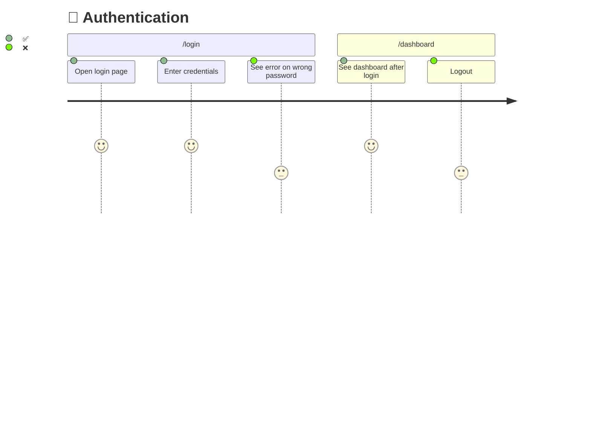

<div align="center">

# 🧭 Pathfinder

### Map every user journey. See what's tested. Fill the gaps.

An AI-agent skill that discovers user journeys in any codebase, visualizes test coverage with interactive Mermaid diagrams, and generates framework-correct UI tests to close the gaps.

[](LICENSE)
[](https://python.org)
[](tests/)

**Works with:** Claude Code · GitHub Copilot · Codex · Cursor · Windsurf · Aider · OpenClaw · any AI coding agent

[Installation](#-installation) · [How It Works](#-how-it-works) · [Supported Frameworks](#-supported-frameworks) · [Commands](#-commands)

</div>

---

## 🎯 The Problem

You have tests. But can you answer: **"Which user journeys are actually covered?"**

Line coverage says 78%. But can a user sign up, upload a file, and view the result end-to-end? Nobody knows. There's no map.

**Pathfinder fixes this.** It crawls your codebase, discovers every user journey, and produces a **living coverage map** — so you can see exactly where the gaps are and fill them systematically.

---

## ⚡ Quick Start

```bash
bash <(curl -fsSL https://raw.githubusercontent.com/srpadrono/Pathfinder/main/install/install.sh)
```

<details>
<summary>Or install manually</summary>

```bash
git clone https://github.com/srpadrono/Pathfinder.git ~/.pathfinder
cd your-project
python3 ~/.pathfinder/scripts/pathfinder-init.py
```

Then set up for your agent → **[Installation Guide](docs/installation.md)**

</details>

Then tell your AI agent:

```
/map
```

---

## 🔍 How It Works

Pathfinder runs in **four phases**, each named after trail exploration:

<table>
<tr>
<td width="25%" align="center">

### 🗺️ Map
**Discover the terrain**

Deep dives into routes, screens, components, and API calls. Groups them into user journeys. Checks which steps already have tests.

</td>
<td width="25%" align="center">

### 🔥 Blaze
**Mark the trail**

Generates Mermaid journey diagrams with **✅** tested and **❌** untested markers. Produces a coverage summary table.

</td>
<td width="25%" align="center">

### 🔭 Scout
**Explore the gaps**

Generates framework-correct test skeletons for every ❌ step. Appends to existing files or creates new ones matching your patterns.

</td>
<td width="25%" align="center">

### ⛰️ Summit
**Reach the peak**

Runs all tests, reconciles results, updates the diagrams, and computes a coverage score. ❌ → ✅

</td>
</tr>
</table>

```
/map  ──→  /blaze  ──→  /scout  ──→  /summit
  │           │            │            │
  ▼           ▼            ▼            ▼
Crawl      Mermaid      Write        Run all
code       ✅ / ❌      tests        Update ❌→✅
  │           │            │            │
  └───────────┴────────────┴────────────┘
                     │
              journeys.json
            (source of truth)
```

The cycle repeats. New code → `/map` → new ❌ steps → `/scout` → `/summit`. The diagram always reflects reality.

---

## 📊 What You Get

### Journey Diagrams

Every user journey becomes a visual Mermaid diagram:



### Coverage Table

```
| Journey            | Steps | Tested | Coverage    |
|--------------------|-------|--------|-------------|
| 🔐 Authentication  | 5     | 3      | 🟡 60.0%   |
| 📤 File Upload     | 8     | 0      | 🔴 0.0%    |
| 📄 Reports         | 12    | 7      | 🟡 58.3%   |
| 💬 Chat            | 6     | 6      | 🟢 100.0%  |
| **Total**          | **31**| **16** | **51.6%**   |
```

### Coverage Score

| Score | Status | Meaning |
|-------|--------|---------|
| 🟢 **80%+** | Excellent | Ship it |
| 🟡 **50–79%** | Acceptable | Document the gaps |
| 🔴 **<50%** | Insufficient | Keep scouting |

---

## 🛠️ Supported Frameworks

Pathfinder **auto-detects** your UI test framework and generates tests with the correct selectors, waits, and patterns:

| Framework | Platform | Selectors | Auto-detected from |
|-----------|----------|-----------|-------------------|
| **Playwright** | Web | `getByRole`, `getByTestId` | `playwright.config.ts` |
| **Cypress** | Web | `cy.get('[data-cy=]')` | `cypress.config.ts` |
| **Maestro** | Mobile | `id:`, `text:` | Expo `app.json` |
| **Detox** | React Native | `by.id()`, `by.label()` | `.detoxrc.js` |
| **XCUITest** | iOS | `app.buttons[""]` | `.xcodeproj` |
| **Espresso** | Android | `withId()`, `withText()` | `build.gradle` |
| **Flutter** | Flutter | `find.byKey()` | `integration_test/` |

Each framework has a dedicated reference guide with selector strategies, wait patterns, and test templates — loaded only when needed.

---

## 🧠 Smart Test Generation

The test generator adapts to **your project's existing patterns**:

```bash
# Auto-detect: appends to existing auth.spec.ts or creates new file
python3 ~/.pathfinder/skills/ui-testing/scripts/generate-ui-test.py \
  AUTH-05 "Logout redirects to login" playwright --route /dashboard --auto
```

| Feature | How it works |
|---------|-------------|
| **Auto-append** | Finds existing journey file → inserts inside `test.describe()` block |
| **Auto-create** | No existing file → creates with proper imports, describe wrapper, auth setup |
| **Test directory** | Reads from `playwright.config.ts` / `cypress.config.ts` — no hardcoded paths |
| **Auth detection** | Detects `storageState` pattern and includes authenticated setup |
| **Selectors** | Accessibility-first: `getByRole` > `getByTestId` > `getByText` > CSS (last resort) |
| **Waits** | Condition-based only: `waitForLoadState`, `waitForExistence` — never `sleep()` |
| **Visual regression** | Screenshot baseline capture + pixel-level diff comparison |

---

## 📦 Installation

**One-liner** (interactive — picks your platform):

```bash
bash <(curl -fsSL https://raw.githubusercontent.com/srpadrono/Pathfinder/main/install/install.sh)
```

**Manual** — see platform-specific guides in **[docs/installation.md](docs/installation.md)**:

| Platform | Config file | Setup command |
|----------|------------|---------------|
| Claude Code | `CLAUDE.md` | `bash ~/.pathfinder/install/setup-claude-code.sh` |
| GitHub Copilot | `AGENTS.md` / `.github/copilot-instructions.md` | `bash ~/.pathfinder/install/setup-copilot.sh` |
| Codex | `AGENTS.md` | `bash ~/.pathfinder/install/setup-codex.sh` |
| Cursor | `.cursorrules` | `bash ~/.pathfinder/install/setup-cursor.sh` |
| Windsurf | `.windsurfrules` | `bash ~/.pathfinder/install/setup-windsurf.sh` |
| Aider | `.aider.conf.yml` | `bash ~/.pathfinder/install/setup-aider.sh` |
| OpenClaw | Skills symlink | `bash ~/.pathfinder/install/setup-openclaw.sh` |

---

## 💻 Commands

### Agent Commands

| Command | What happens |
|---------|-------------|
| `/map` | Discover all user journeys in the codebase |
| `/blaze` | Generate Mermaid coverage diagrams |
| `/scout` | Write UI tests for untested steps |
| `/summit` | Run tests, update diagrams, compute score |

### CLI Scripts

```bash
# Initialize Pathfinder in a project
python3 ~/.pathfinder/scripts/pathfinder-init.py

# Scan existing test coverage
python3 ~/.pathfinder/skills/mapping/scripts/scan-test-coverage.py .

# Generate coverage diagrams
python3 ~/.pathfinder/skills/blazing/scripts/generate-diagrams.py .pathfinder/journeys.json

# Detect UI framework
python3 ~/.pathfinder/skills/ui-testing/scripts/detect-ui-framework.py .

# Generate a test skeleton
python3 ~/.pathfinder/skills/ui-testing/scripts/generate-ui-test.py \
  FEAT-01 "User can upload file" playwright --route /upload --auto

# Compute coverage score
python3 ~/.pathfinder/scripts/coverage-score.py .pathfinder/journeys.json

# Visual regression
python3 ~/.pathfinder/skills/ui-testing/scripts/snapshot-compare.py capture login screenshot.png
python3 ~/.pathfinder/skills/ui-testing/scripts/snapshot-compare.py compare login new.png
```

---

## ⚙️ Configuration

Pathfinder auto-detects everything. Optionally create `.pathfinder/config.json` to customize:

```json
{
  "project": "my-app",
  "framework": "playwright",
  "testDir": "e2e/tests",
  "unitRunner": "vitest",
  "auth": {
    "storageState": "e2e/.auth/user.json"
  }
}
```

---

## 📁 Project Structure

```
~/.pathfinder/
├── skills/
│   ├── mapping/              🗺️  Discover user journeys
│   │   └── scripts/             scan-test-coverage.py
│   ├── blazing/              🔥  Generate Mermaid diagrams
│   │   └── scripts/             generate-diagrams.py
│   ├── scouting/             🔭  Write tests for gaps
│   ├── summiting/            ⛰️  Run tests, compute coverage
│   ├── ui-testing/           🧪  Framework detection + test generation
│   │   ├── references/          7 framework-specific guides
│   │   └── scripts/             detect, generate, snapshot
│   └── using-pathfinder/     🧭  Entry point + quick reference
├── scripts/                     pathfinder-init.py, coverage-score.py
├── install/                     8 platform setup scripts
├── tests/                       20 self-tests
└── .githooks/                   pre-commit, post-commit, pre-push
```

---

## 🔗 Git Hooks

Enable with: `git config core.hooksPath ~/.pathfinder/.githooks`

| Hook | What it does |
|------|-------------|
| **pre-commit** | Validates `journeys.json` is valid JSON |
| **post-commit** | Auto-regenerates diagrams when `journeys.json` changes |
| **pre-push** | Blocks direct push to `main` / `master` |

---

## 📋 Requirements

| Requirement | Purpose |
|-------------|---------|
| **Python 3** | Runs all scripts |
| **Git** | Version control for journey maps |
| **UI test framework** | Auto-detected, or specify in config |
| **Pillow** *(optional)* | Pixel-level visual regression |

---

## 📄 License

MIT — use it, fork it, improve it.

---

<div align="center">

**Map the terrain. Blaze the markers. Scout the gaps. Reach the summit.**

🗺️ → 🔥 → 🔭 → ⛰️

[Get Started](#-quick-start) · [View on GitHub](https://github.com/srpadrono/Pathfinder)

</div>
