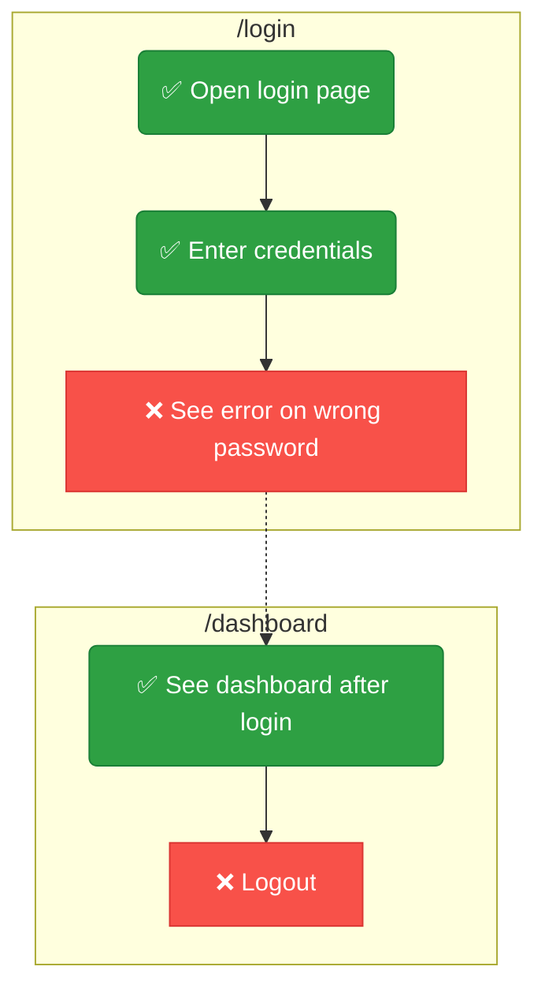
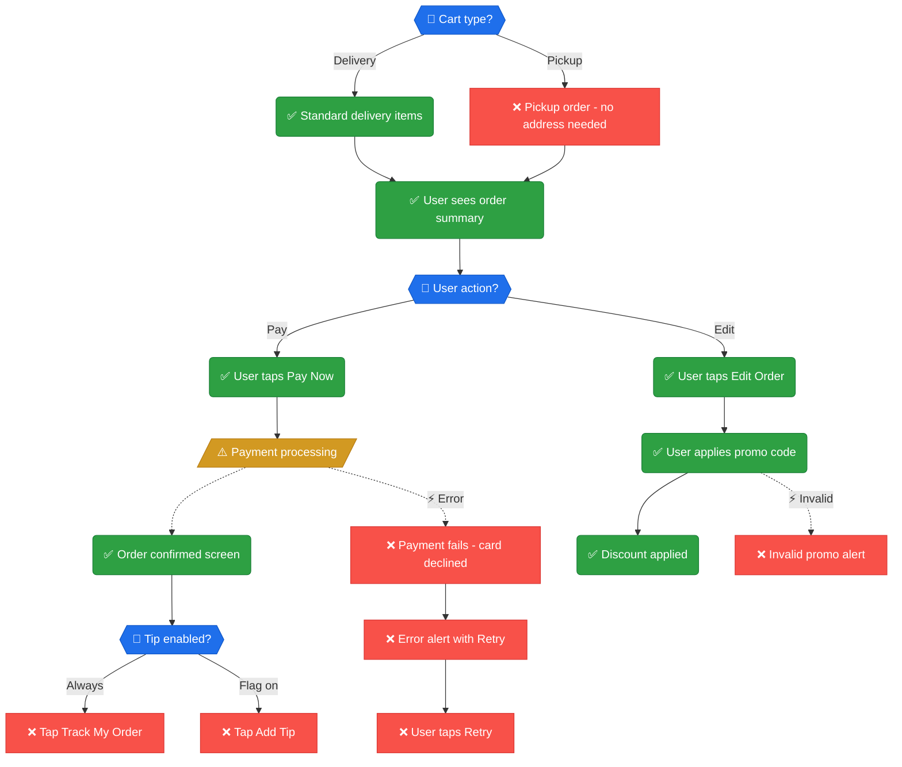
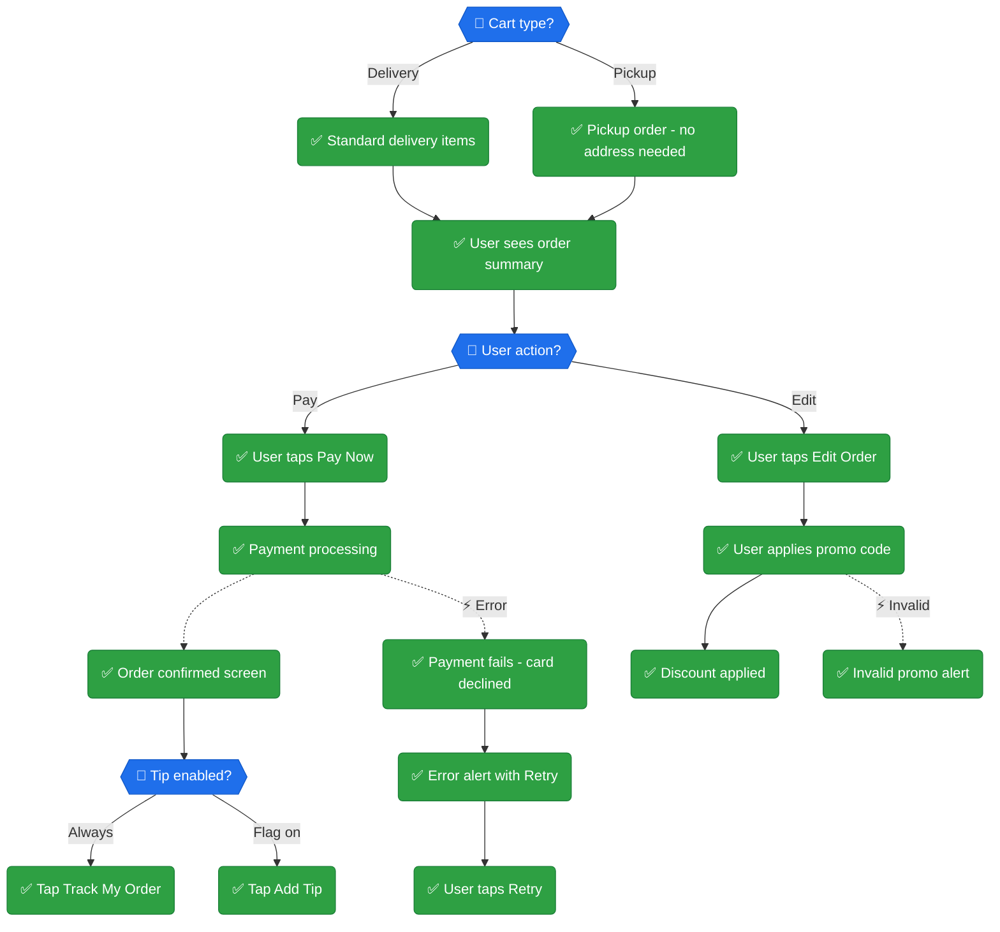

<div align="center">

# 🧭 Pathfinder

### Map every user journey. See what's tested. Fill the gaps.

An AI-agent skill that discovers user journeys in any codebase, visualizes test coverage with interactive Mermaid diagrams, and generates framework-correct UI tests to close the gaps.

[](LICENSE)
[](https://python.org)
[](tests/)

**Works with:** Claude Code (plugin) · Codex · Gemini CLI · Cursor

[Installation](#-installation) · [How It Works](#-how-it-works) · [Supported Frameworks](#-supported-frameworks) · [Commands](#-commands)

</div>

---

## 🎯 The Problem

You have tests. But can you answer: **"Which user journeys are actually covered?"**

Line coverage says 78%. But can a user sign up, upload a file, and view the result end-to-end? Nobody knows. There's no map.

**Pathfinder fixes this.** It crawls your codebase, discovers every user journey, and produces a **living coverage map** — so you can see exactly where the gaps are and fill them systematically.


https://github.com/user-attachments/assets/0d42691c-98a1-4f2a-a27c-a4f0e5980ea6


---

## 🔍 How It Works

Pathfinder runs in **four phases**, each named after trail exploration:

<table>
<tr>
<td width="25%" align="center">

### 🗺️ Map
**Discover the terrain**

Deep dives into routes, screens, components, and API calls. Groups them into user journeys. Checks which steps already have tests.

</td>
<td width="25%" align="center">

### 🔥 Blaze
**Mark the trail**

Generates Mermaid flowcharts with **✅** tested and **❌** untested markers. Produces a coverage summary table.

</td>
<td width="25%" align="center">

### 🔭 Scout
**Explore the gaps**

Generates framework-correct test skeletons for every ❌ step. Appends to existing files or creates new ones matching your patterns.

</td>
<td width="25%" align="center">

### ⛰️ Summit
**Reach the peak**

Runs all tests, reconciles results, updates the diagrams, and computes a coverage score. ❌ → ✅

</td>
</tr>
</table>

```
/map  ──→  /blaze  ──→  /scout  ──→  /summit
  │           │            │            │
  ▼           ▼            ▼            ▼
Crawl      Mermaid      Write        Run all
code       ✅ / ❌      tests        Update ❌→✅
  │           │            │            │
  └───────────┴────────────┴────────────┘
                     │
              journeys.json
            (source of truth)
```

The cycle repeats. New code → `/map` → new ❌ steps → `/scout` → `/summit`. The diagram always reflects reality.

---

## 📊 What You Get

### Journey Flowcharts

Every user journey becomes a visual flowchart — green = tested, red = gap:



### Coverage Table

```
| Journey            | Steps | Tested | Coverage    |
|--------------------|-------|--------|-------------|
| 🔐 Authentication  | 5     | 3      | 🟡 60.0%   |
| 📤 File Upload     | 8     | 0      | 🔴 0.0%    |
| 📄 Reports         | 12    | 7      | 🟡 58.3%   |
| 💬 Chat            | 6     | 6      | 🟢 100.0%  |
| **Total**          | **31**| **16** | **51.6%**   |
```

### Coverage Score

| Score | Status | Meaning |
|-------|--------|---------|
| 🟢 **80%+** | Excellent | Ship it |
| 🟡 **50–79%** | Acceptable | Document the gaps |
| 🔴 **<50%** | Insufficient | Keep scouting |

---

## 🏪 Example

Here's Pathfinder on a **food delivery app's checkout module** — 5 journeys, 28 steps, taken from 52% to 100% coverage in one session.

### 📸 Before (52%)



### 🚀 After (100%)



### 📊 Coverage Delta

| Journey | Before | After | Delta |
|---------|--------|-------|-------|
| 🛒 Checkout (Pay) | 50% | 100% | +3 steps |
| ✏️ Edit Order (Promo) | 75% | 100% | +1 step |
| 🚗 Pickup variant | 0% | 100% | +1 step |
| 💳 Payment errors | 0% | 100% | +3 steps |
| 💰 Tip feature flag | 0% | 100% | +1 step |
| **Total** | **52%** | **✅ 100%** | **+9 steps, 22 tests** |

> All generated in one `/map` → `/blaze` → `/scout` → `/summit` session.

---

## 🛠️ Supported Frameworks

Pathfinder **auto-detects** your UI test framework and generates tests with the correct selectors, waits, and patterns:

| Framework | Platform | Selectors | Auto-detected from |
|-----------|----------|-----------|-------------------|
| **Playwright** | Web | `getByRole`, `getByTestId` | `playwright.config.ts` |
| **Cypress** | Web | `cy.get('[data-cy=]')` | `cypress.config.ts` |
| **Maestro** | Mobile | `id:`, `text:` | Expo `app.json` |
| **Detox** | React Native | `by.id()`, `by.label()` | `.detoxrc.js` |
| **XCUITest** | iOS | `app.buttons[""]` | `.xcodeproj` |
| **Espresso** | Android | `withId()`, `withText()` | `build.gradle` |
| **Flutter** | Flutter | `find.byKey()` | `integration_test/` |

Each framework has a dedicated reference guide with selector strategies, wait patterns, and test templates — loaded only when needed.

---

## 🧠 Smart Test Generation

The test generator adapts to **your project's existing patterns**:

```bash
# Auto-detect: appends to existing auth.spec.ts or creates new file
python3 ~/.agents/skills/pathfinder/scripts/generate-ui-test.py \
  AUTH-05 "Logout redirects to login" playwright --route /dashboard --auto
```

| Feature | How it works |
|---------|-------------|
| **Auto-append** | Finds existing journey file → inserts inside `test.describe()` block |
| **Auto-create** | No existing file → creates with proper imports, describe wrapper, auth setup |
| **Test directory** | Reads from `playwright.config.ts` / `cypress.config.ts` — no hardcoded paths |
| **Auth detection** | Detects `storageState` pattern and includes authenticated setup |
| **Selectors** | Accessibility-first: `getByRole` > `getByTestId` > `getByText` > CSS (last resort) |
| **Waits** | Condition-based only: `waitForLoadState`, `waitForExistence` — never `sleep()` |
| **Visual regression** | Screenshot baseline capture + pixel-level diff comparison |

---

## Installation

```bash
bash <(curl -fsSL https://raw.githubusercontent.com/srpadrono/Pathfinder/main/install/install.sh)
```

One command — clones the repo, symlinks skills, and installs the Claude Code plugin automatically. See **[docs/installation.md](docs/installation.md)** for details.

---

## 💻 Commands

### Agent Commands

| Command | What happens |
|---------|-------------|
| `/map` | Discover all user journeys in the codebase |
| `/blaze` | Generate Mermaid flowcharts |
| `/scout` | Write UI tests for untested steps |
| `/summit` | Run tests, update diagrams, compute score |

---

## 📁 Project Structure

```
~/.agents/pathfinder/                    Repo clone
├── .claude-plugin/                      Plugin + marketplace manifest
│   ├── plugin.json
│   └── marketplace.json
├── skills/                              Skills (symlinked into ~/.agents/skills/)
│   ├── pathfinder/                      Main skill — auto-triggers on coverage questions
│   │   ├── SKILL.md                     Entry point
│   │   ├── references/                  8 framework + testing reference docs
│   │   ├── scripts/                     9 Python CLI tools
│   │   └── assets/                      Starter templates
│   ├── map/                             /map command skill
│   ├── blaze/                           /blaze command skill
│   ├── scout/                           /scout command skill
│   └── summit/                          /summit command skill
├── hooks/                               SessionStart hook
├── install/                             Installer
├── tests/                               27 self-tests
├── .githooks/                           pre-commit, post-commit, pre-push
└── README.md                            Documentation

~/.agents/skills/                        Shared skills directory
├── pathfinder -> ../pathfinder/skills/pathfinder
├── map -> ../pathfinder/skills/map
├── blaze -> ../pathfinder/skills/blaze
├── scout -> ../pathfinder/skills/scout
└── summit -> ../pathfinder/skills/summit
```

---

## 🔗 Git Hooks

Enable with: `git config core.hooksPath ~/.agents/pathfinder/.githooks`

| Hook | What it does |
|------|-------------|
| **pre-commit** | Validates `journeys.json` is valid JSON |
| **post-commit** | Auto-regenerates diagrams when `journeys.json` changes |
| **pre-push** | Blocks direct push to `main` / `master` |

---

## 📋 Requirements

| Requirement | Purpose |
|-------------|---------|
| **Python 3** | Runs all scripts |
| **Git** | Version control for journey maps |
| **UI test framework** | Auto-detected, or specify in config |
| **Pillow** *(optional)* | Pixel-level visual regression |

---

## 📄 License

MIT — use it, fork it, improve it.

---

<div align="center">

**Map the terrain. Blaze the markers. Scout the gaps. Reach the summit.**

🗺️ → 🔥 → 🔭 → ⛰️

[Get Started](#-quick-start) · [View on GitHub](https://github.com/srpadrono/Pathfinder)

</div>
