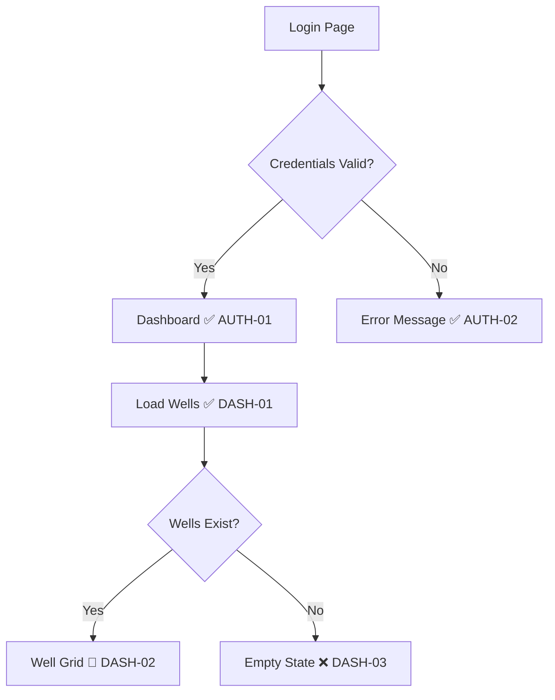

<p align="center">
  
</p>

<p align="center">
  <strong>Marks the trail before others follow.</strong><br>
  A TDD workflow that charts user journeys, plants test checkpoints, and guides implementation along a proven trail.
</p>

<p align="center">
  <a href="https://github.com/srpadrono/Pathfinder/actions/workflows/pathfinder.yml">
    
  </a>
  <a href="https://github.com/srpadrono/Pathfinder/blob/main/LICENSE">
    
  </a>
  <a href="https://github.com/srpadrono/Pathfinder/releases">
    
  </a>
  <a href="https://github.com/srpadrono/Pathfinder/stargazers">
    
  </a>
  <br>
  <a href="https://www.typescriptlang.org/">
    
  </a>
  <a href="https://playwright.dev/">
    
  </a>
  <a href="https://github.com/srpadrono/Pathfinder/pulls">
    
  </a>
</p>

<p align="center">
  <a href="#-features">Features</a> •
  <a href="#-quick-start">Quick Start</a> •
  <a href="#-the-expedition">The Expedition</a> •
  <a href="#-documentation">Documentation</a> •
  <a href="#-contributing">Contributing</a>
</p>

---

## 🎯 What is Pathfinder?


**Pathfinder** is a structured TDD (Test-Driven Development) workflow designed for teams building modern web applications. It uses an expedition metaphor where:

- **Scouts** survey terrain, chart maps, and mark trails (write tests first)
- **Builders** follow the marked trail and clear checkpoints (implement features)

The result? Every feature ships with complete test coverage, visual documentation, and a clear audit trail.

## ✨ Features

- 🗺️ **Visual Trail Maps** — Mermaid diagrams show user journeys at a glance
- ✅ **Checkpoint System** — Track test status with intuitive markers (❌ → 🔄 → ✅)
- 👥 **Two-Agent Workflow** — Scout/Builder pattern prevents test-after-implementation anti-pattern
- 📸 **Evidence Collection** — Automatic screenshots for every checkpoint
- 🔄 **CI/CD Ready** — GitHub Actions workflow included
- 📊 **Coverage Tracking** — Auto-sync test results to trail maps
- 🎨 **PR Templates** — Expedition reports with evidence and diagrams

## 🚀 Quick Start

### Prerequisites

- Node.js 18+
- npm or pnpm

### Installation

```bash
# Clone the repository
git clone https://github.com/srpadrono/Pathfinder.git
cd Pathfinder

# Install dependencies
npm install

# Install Playwright browsers
npx playwright install chromium
```

### First Expedition

```bash
# 1. Set up environment
cp .env.example .env.local
# Edit .env.local with your test credentials

# 2. Establish base camp (authenticate)
npx tsx scripts/setup-auth.ts

# 3. Run the expedition
npx tsx e2e/test-example.ts

# 4. Update the trail map
npx tsx scripts/update-coverage.ts
```

## 🏔️ The Expedition

Like real pathfinders on an expedition, development follows a structured journey:

| Phase | Action | Output |
|-------|--------|--------|
| **1. Survey** | Review specs, identify edge cases | Clarifying questions |
| **2. Chart** | Draw user journey diagram | Mermaid trail map |
| **3. Mark** | Identify all checkpoints | Test case IDs (❌) |
| **4. Scout** | Write failing tests | Tests ready (🔄) |
| **5. Build** | Implement features | Tests passing (✅) |
| **6. Report** | Create PR with evidence | Expedition report |

### Trail Markers

| Marker | Status | Meaning |
|--------|--------|---------|
| ❌ | Uncharted | Checkpoint identified |
| 🔄 | Scouted | Test written, awaiting implementation |
| ✅ | Cleared | Test passing |
| ⚠️ | Unstable | Flaky test needs attention |
| ⏭️ | Skipped | Out of scope |

### Example Trail Map



## 📚 Documentation

| Document | Description |
|----------|-------------|
| [Installation Guide](references/installation.md) | Add Pathfinder to existing projects |
| [TDD Workflow](references/tdd-workflow.md) | Scout/Builder protocol details |
| [Journey Format](references/journey-format.md) | Trail map specification |
| [Component Integration](references/component-driven.md) | Works with component-driven dev |
| [CI/CD Setup](references/ci-integration.md) | GitHub Actions configuration |

## 🗂️ Project Structure

```
pathfinder/
├── 📁 assets/               # Templates and branding
│   ├── PR_TEMPLATE.md       # Expedition report template
│   ├── USER-JOURNEYS-TEMPLATE.md
│   ├── example-test.ts      # Test file starter
│   ├── logo.png             # Project logo
│   └── banner.png           # GitHub banner
├── 📁 references/           # Documentation
│   ├── installation.md
│   ├── tdd-workflow.md
│   ├── journey-format.md
│   ├── component-driven.md
│   └── ci-integration.md
├── 📁 scripts/              # Core utilities
│   ├── setup-auth.ts        # Authentication setup
│   ├── run-tests.ts         # Test runner
│   └── update-coverage.ts   # Coverage sync
└── SKILL.md                 # Agent skill definition
```

## 🛠️ Scripts

| Script | Purpose |
|--------|---------|
| `setup-auth.ts` | Establish base camp — saves authentication state |
| `run-tests.ts` | Execute tests with screenshot evidence |
| `update-coverage.ts` | Sync test results to trail maps |

## 🤝 Contributing

We love contributions! Pathfinder is built by the community, for the community.

### Ways to Contribute

- 🐛 **Report Bugs** — [Open an issue](https://github.com/srpadrono/Pathfinder/issues/new?template=bug_report.md)
- 💡 **Request Features** — [Start a discussion](https://github.com/srpadrono/Pathfinder/discussions)
- 📝 **Improve Docs** — Fix typos, add examples, clarify explanations
- 🔧 **Submit PRs** — Bug fixes, features, and improvements welcome

### Development Setup

```bash
# Fork and clone
git clone https://github.com/YOUR_USERNAME/Pathfinder.git
cd Pathfinder

# Create a branch
git checkout -b feature/amazing-feature

# Make changes and test
npm test

# Submit a PR
```

Please read our [Contributing Guidelines](CONTRIBUTING.md) before submitting PRs.

## 📋 Roadmap

- [ ] VS Code extension for trail map visualization
- [ ] Support for additional test frameworks (Jest, Vitest)
- [ ] Interactive dashboard for coverage metrics
- [ ] Slack/Discord integration for expedition updates
- [ ] Auto-generation of trail maps from user stories

See the [open issues](https://github.com/srpadrono/Pathfinder/issues) for a full list of proposed features.

## 💬 Community

- 💡 [GitHub Discussions](https://github.com/srpadrono/Pathfinder/discussions) — Questions, ideas, and showcases
- 🐛 [Issue Tracker](https://github.com/srpadrono/Pathfinder/issues) — Bug reports and feature requests
- 🐦 Follow updates on social media

## 📄 License

Distributed under the MIT License. See [LICENSE](LICENSE) for more information.

## 🙏 Acknowledgments

- [Playwright](https://playwright.dev/) — Reliable end-to-end testing
- [Mermaid](https://mermaid.js.org/) — Diagramming and charting
- The open source community for inspiration and feedback

---

<p align="center">
  <sub>Built with ❤️ by <a href="https://github.com/srpadrono">Sergio Padron</a></sub>
</p>

<p align="center">
  <a href="#-what-is-pathfinder">Back to top ↑</a>
</p>
