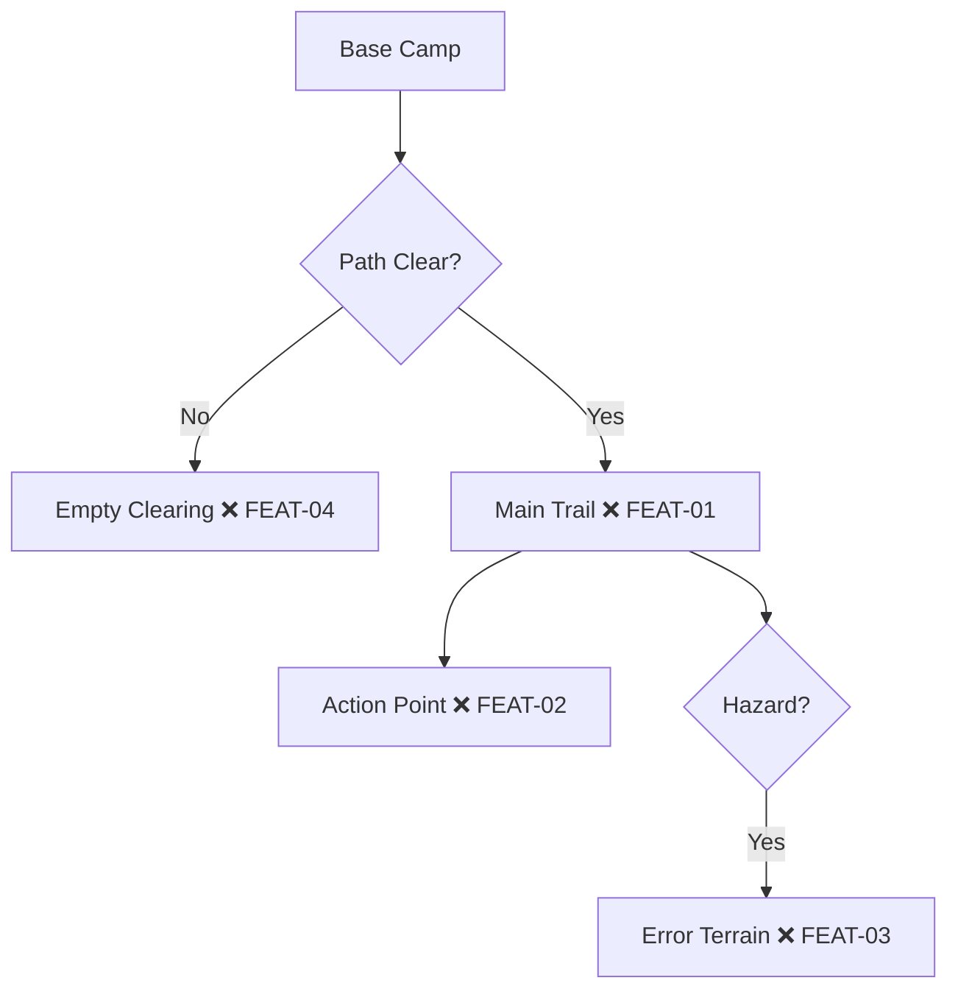

# Pathfinder

*Marks the trail before others follow.*

TDD workflow that charts user journeys through flow diagrams, plants test checkpoints, and guides implementation along a proven trail.

## The Expedition

Like pathfinders on an expedition:

| Phase | Action | Output |
|-------|--------|--------|
| **Survey** | Review specs, identify hazards | Clarifying questions |
| **Chart** | Draw flow diagram | Mermaid trail map |
| **Mark** | Identify all checkpoints | Test case IDs (❌) |
| **Scout** | Write tests | Failing tests (🔄) |
| **Build** | Implement features | Passing tests (✅) |
| **Report** | Create PR | Evidence + map |

## Quick Start

```bash
# Establish base camp (auth)
npx tsx scripts/setup-auth.ts

# Scout the trail (run tests)
npx tsx e2e/test-{feature}.ts

# Update trail map (sync coverage)
npx tsx scripts/update-coverage.ts
```

## Phase 1: Survey the Terrain

When given a feature request:
1. Review all requirements
2. Ask about hazards (edge cases, errors, empty states)
3. Confirm the route before charting

**Example questions:**
- "What happens if no wells exist?"
- "Should filters persist on refresh?"
- "How should API errors be displayed?"

## Phase 2: Chart the Map

Create Mermaid diagram in `USER-JOURNEYS.md`:



**Node format:** `[Description MARKER ID]`

## Phase 3: Mark the Trail

Extract ALL checkpoints from specs:

```typescript
const CHECKPOINTS = [
  { id: 'FEAT-01', category: 'Happy Path', description: 'Base camp loads' },
  { id: 'FEAT-02', category: 'Action', description: 'Trail action works' },
  { id: 'FEAT-03', category: 'Error', description: 'Hazard handled' },
  { id: 'FEAT-04', category: 'Empty', description: 'Clearing shown' },
];
```

**Naming:** `{JOURNEY}-{NUMBER}` (DASH-01, WELL-05, AUTH-03)

## Phase 4: Scout (Write Tests)

Create test file:

```typescript
import { TestRunner, Page, BASE } from '../scripts/run-tests';

const CHECKPOINTS = [
  {
    id: 'FEAT-01',
    journey: 'feature',
    description: 'Base camp loads',
    fn: async (page: Page) => {
      await page.goto(`${BASE}/feature`);
      if (!(await page.locator('h1').isVisible())) {
        throw new Error('Checkpoint not reached');
      }
    },
  },
];

new TestRunner().run(CHECKPOINTS);
```

Update diagram: ❌ → 🔄

**Handoff:** `@builder — Trail marked for FEAT-01 through FEAT-04`

## Phase 5: Build (Implement)

Builder follows the marked trail:

```bash
npx tsx e2e/test-{feature}.ts
```

As each checkpoint clears: 🔄 → ✅

**Completion:** `@scout — Trail cleared. Evidence: /tmp/test-screenshots/...`

## Phase 6: Expedition Report (PR)

Use template from `assets/PR_TEMPLATE.md`:

1. **Trail Map** — Mermaid diagram with all ✅
2. **Checkpoint Status** — Table with pass/fail
3. **Evidence** — Screenshots linked
4. **Expedition Log** — Checklist completed

## Trail Markers

| Marker | Name | Meaning |
|--------|------|---------|
| ❌ | Uncharted | Checkpoint identified |
| 🔄 | Scouted | Test written, not passing |
| ✅ | Cleared | Test passing |
| ⚠️ | Unstable | Flaky test |
| ⏭️ | Skipped | Out of scope |

## Expedition Team

| Role | Territory | Mission |
|------|-----------|---------|
| **Scout** | `e2e/`, `USER-JOURNEYS.md` | Survey, chart, mark, write tests (❌→🔄) |
| **Builder** | `src/` | Implement features, clear checkpoints (🔄→✅) |

**Rules:**
- Scout never modifies `src/`
- Builder never modifies test assertions
- Both can read everything
- Explicit handoff always

See [references/tdd-workflow.md](references/tdd-workflow.md) for detailed protocol.

## Agent Dispatch

**Same session:** One agent switches between scout/builder modes.

**Sub-agent:**
```typescript
sessions_spawn({
  task: "Clear trail for FEAT-01 through FEAT-04",
  label: "builder-feature"
});
```

**Parallel sessions:** Separate chats with handoff via `USER-JOURNEYS.md`.

## Scripts

| Script | Purpose |
|--------|---------|
| `setup-auth.ts` | Establish base camp (login, save auth) |
| `run-tests.ts` | Scout trail with screenshots |
| `update-coverage.ts` | Sync results to trail map |

## Assets

| File | Purpose |
|------|---------|
| `PR_TEMPLATE.md` | Expedition report template |
| `USER-JOURNEYS-TEMPLATE.md` | Trail map starter |
| `example-test.ts` | Test file example |

## References

| File | Topic |
|------|-------|
| `tdd-workflow.md` | Scout/builder protocol |
| `journey-format.md` | Trail map format |
| `component-driven.md` | Component-driven development integration |
| `ci-integration.md` | GitHub Actions setup |
| `installation.md` | Add to existing project |

## Environment

Required in `.env.local`:
```
TEST_EMAIL=scout@example.com
TEST_PASSWORD=secret
BASE_URL=http://localhost:3000
```

Never commit credentials. Always use env vars.

## CI Integration

See [references/ci-integration.md](references/ci-integration.md) for:
- GitHub Actions workflow
- Headless testing
- Coverage comments on PRs
- Nightly expeditions

## Add to Existing Project

See [references/installation.md](references/installation.md) for:
- Directory structure
- npm scripts
- First journey creation
- Team setup
