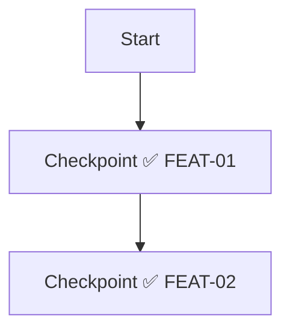

# 🗺️ Expedition Report: [Feature Name]

## Summary
<!-- Brief description of what trail was cleared -->

## Trail Map



## Checkpoint Status

| ID | Checkpoint | Status | Evidence |
|----|------------|--------|----------|
| FEAT-01 | Description | ✅ | [screenshot](./evidence/FEAT-01-pass.png) |
| FEAT-02 | Description | ✅ | [screenshot](./evidence/FEAT-02-pass.png) |

## Coverage

- **Total Checkpoints:** X
- **Cleared:** X ✅
- **Blocked:** 0 ❌
- **Coverage:** 100%

## Expedition Log

### Scout Phase
- [ ] Terrain surveyed (specs reviewed)
- [ ] Map charted (flow diagram created)
- [ ] Trail marked (tests written)
- [ ] Hazards identified (edge cases covered)

### Builder Phase
- [ ] Trail cleared (all tests passing)
- [ ] No regressions (existing tests still pass)
- [ ] Code reviewed

## Evidence

Screenshots: `/tmp/test-screenshots/[TIMESTAMP]/`

<details>
<summary>📸 View Screenshots</summary>

| Checkpoint | Screenshot |
|------------|------------|
| FEAT-01 |  |
| FEAT-02 |  |

</details>

## Test Commands

```bash
# Establish base camp
npx tsx scripts/setup-auth.ts

# Scout the trail
npx tsx e2e/test-[feature].ts

# Update coverage
npx tsx scripts/update-coverage.ts --results /tmp/test-results.json
```

## Related

- Trail Map: `docs/test-coverage/USER-JOURNEYS.md`
- Tests: `e2e/test-[feature].ts`

---
*Generated by [Pathfinder](https://github.com/your-org/pathfinder) — Marks the trail before others follow.*
