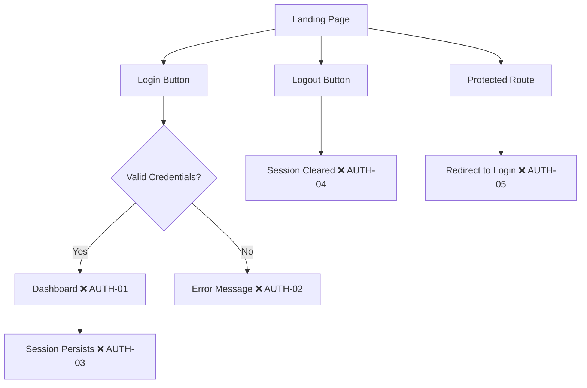
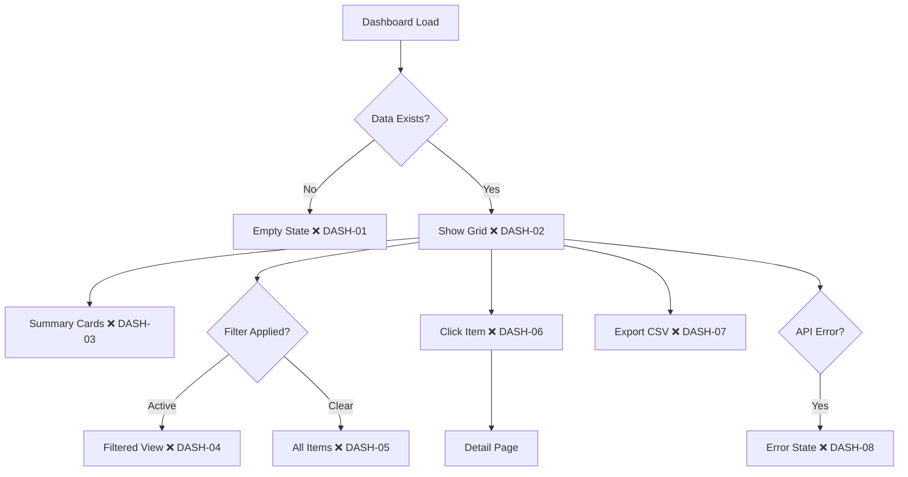
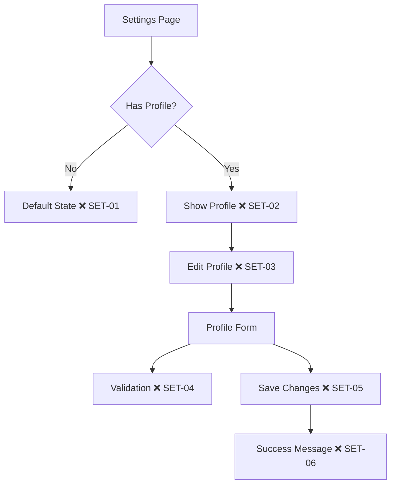

> **Note:** This is an extended example. For the minimal template, see `templates/user-journeys.md`.

# 🗺️ Trail Map — User Journeys

*Last updated: YYYY-MM-DD*

## Coverage Summary

| Journey | Coverage | Checkpoints | Last Scouted |
|---------|----------|-------------|--------------|
| Auth | 0% | 0/5 | - |
| Items | 0% | 0/8 | - |
| Settings | 0% | 0/6 | - |

**Total Coverage:** 0% (0/19 checkpoints cleared)

---

## 🔐 Auth Journey

### Trail Map

### Checkpoints

| ID | Checkpoint | Category | Status | Last Run |
|----|------------|----------|--------|----------|
| AUTH-01 | Login redirects to dashboard | Happy Path | ❌ | - |
| AUTH-02 | Invalid password shows error | Error | ❌ | - |
| AUTH-03 | Session persists on refresh | Happy Path | ❌ | - |
| AUTH-04 | Logout clears session | Happy Path | ❌ | - |
| AUTH-05 | Protected route redirects | Edge Case | ❌ | - |

---

## 📋 Items Journey

### Trail Map

### Checkpoints

| ID | Checkpoint | Category | Status | Last Run |
|----|------------|----------|--------|----------|
| DASH-01 | Empty state shows message | Edge Case | ❌ | - |
| DASH-02 | Grid loads with items | Happy Path | ❌ | - |
| DASH-03 | Summary cards show totals | Happy Path | ❌ | - |
| DASH-04 | Filter shows subset | Happy Path | ❌ | - |
| DASH-05 | Clear filter shows all | Happy Path | ❌ | - |
| DASH-06 | Click navigates to detail | Happy Path | ❌ | - |
| DASH-07 | Export triggers download | Happy Path | ❌ | - |
| DASH-08 | API error shows message | Error | ❌ | - |

---

## ⚙️ Settings Journey

### Trail Map

### Checkpoints

| ID | Checkpoint | Category | Status | Last Run |
|----|------------|----------|--------|----------|
| SET-01 | Default state shows placeholder | Edge Case | ❌ | - |
| SET-02 | Profile data loads | Happy Path | ❌ | - |
| SET-03 | Edit form opens | Happy Path | ❌ | - |
| SET-04 | Invalid input shows error | Error | ❌ | - |
| SET-05 | Save persists changes | Happy Path | ❌ | - |
| SET-06 | Success message appears | Happy Path | ❌ | - |

---

## Trail Markers Legend

| Marker | Meaning |
|--------|---------|
| ❌ | Uncharted — checkpoint identified, not tested |
| 🔄 | Scouted — test written, not yet passing |
| ✅ | Cleared — test passing |
| ⚠️ | Unstable — flaky test, needs investigation |
| ⏭️ | Skipped — intentionally not tested |

---

## Expedition History

| Date | Scout | Expedition | Checkpoints Cleared |
|------|-------|------------|---------------------|
| - | - | - | - |

---

*Maintained by Pathfinder — Marks the trail before others follow.*
