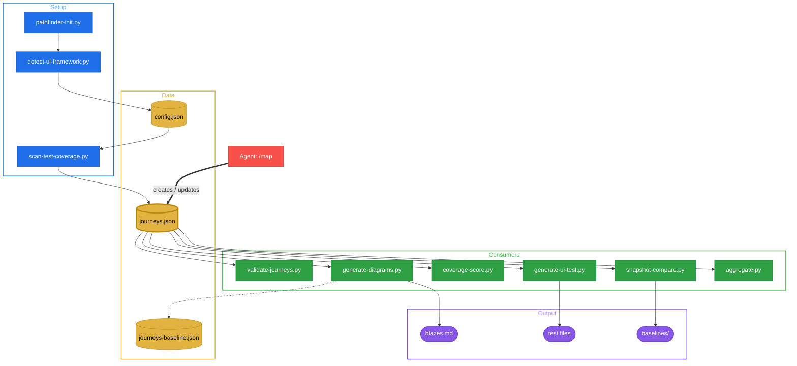

# Architecture

## Data Flow

## journeys.json -- Source of Truth

All scripts read from or write to `journeys.json`. It lives at
`<testDir>/pathfinder/journeys.json` and contains the complete journey map:
journeys, steps, tested status, screen references, and optional notes.

The agent (via `/map`) creates and updates this file. Every downstream script
(`generate-diagrams.py`, `coverage-score.py`, `generate-ui-test.py`) consumes
it without modification. This single-file design means there is exactly one
place to inspect or repair coverage state.

The `validate-journeys.py` script enforces the schema: required fields (`id`,
`name`, `steps`), step ID format (`PREFIX-NN`), no duplicates, and valid
`tested` values (`true`, `false`, `"partial"`).

## Progressive Disclosure

Pathfinder loads only what the current task requires:

1. **SKILL.md** is always loaded -- it describes the workflow and links to
   references.
2. **references/ui-testing.md** is loaded when generating tests -- it covers
   universal selector and wait strategies.
3. **references/<framework>.md** is loaded only when the detected framework
   matches -- one file per project, never all seven.
4. **Scripts** are invoked on demand. The agent calls them as CLI tools; they
   are not imported or preloaded.

This keeps context small. A Playwright project never sees Espresso patterns.

## Script Input/Output Contracts

Each script reads from specific sources and writes JSON to stdout. Errors and
warnings go to stderr. Non-zero exit codes indicate failure.

| Script | Reads | Outputs (stdout) |
|--------|-------|-------------------|
| `pathfinder-init.py` | framework configs, `detect-ui-framework.py` | prints status messages; creates `config.json` |
| `detect-ui-framework.py` | project root files (configs, `package.json`) | `{ uiFramework, platform, unitRunner, referenceFile }` |
| `scan-test-coverage.py` | test files matching glob patterns, route files | `{ testFiles[], routes[], routeCoverage }` |
| `validate-journeys.py` | `journeys.json` | `{ valid, errors[], warnings[], stats }` |
| `generate-diagrams.py` | `journeys.json`, optional `journeys-baseline.json` | summary JSON; writes `blazes.md` to disk |
| `coverage-score.py` | `journeys.json` | `{ totalSteps, tested, partial, untested, coverage, journeys[] }` |
| `generate-ui-test.py` | `journeys.json` (indirectly), framework configs | `{ action, file, checkpoint }`; writes/appends test file |
| `snapshot-compare.py` | image files, `baselines/` directory | `{ action, name, diffPercent, passed }` |
| `aggregate.py` | all `**/pathfinder/journeys.json` in tree | `{ modules[], totalSteps, overallCoverage }` |

## File Layout

| File | Purpose | Created by |
|------|---------|------------|
| `config.json` | Project config (framework, testDir, auth) | `pathfinder-init.py` |
| `journeys.json` | Journey map (source of truth) | `/map` phase |
| `journeys-baseline.json` | Snapshot for before/after comparison | `generate-diagrams.py` (auto-managed) |
| `blazes.md` | Mermaid coverage diagrams | `generate-diagrams.py` |
| `baselines/` | Screenshot baselines | `snapshot-compare.py` |

Scripts live in `skills/pathfinder/scripts/` and share a common helper module
(`pathfinder_paths.py`) for locating `journeys.json` and `config.json` by
walking up the directory tree.
