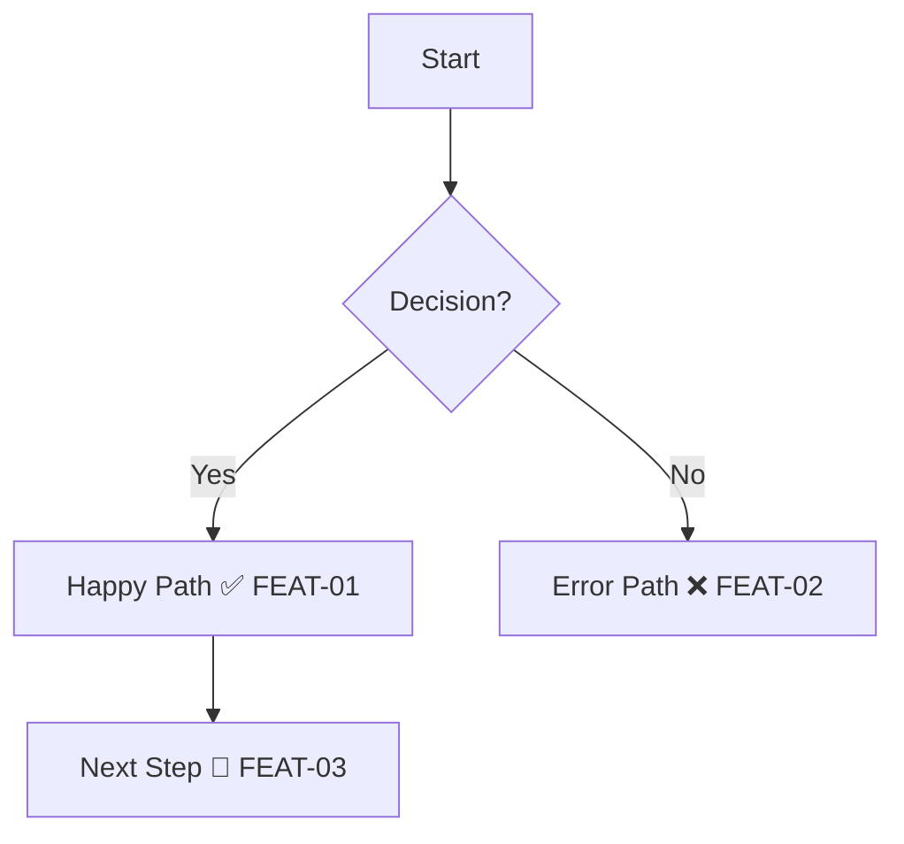

# Trail Map Format

Standard format for `USER-JOURNEYS.md`.

## Location

```
project/docs/test-coverage/USER-JOURNEYS.md
```

## Structure

```markdown
# 🗺️ Trail Map

## Coverage Summary
| Journey | Coverage | Checkpoints |
|---------|----------|-------------|
| Auth    | 56%      | 5/9         |

## Auth Journey

### Trail Map
[Mermaid diagram]

### Checkpoints
[Status table]
```

## Mermaid Diagram

Embed IDs and markers in nodes:



**Format:** `[Description MARKER ID]`

## Checkpoint Table

```markdown
| ID | Checkpoint | Category | Status | Last Run |
|----|------------|----------|--------|----------|
| AUTH-01 | Login redirects | Happy Path | ✅ | 2026-02-08 |
| AUTH-02 | Invalid password | Error | ❌ | - |
```

## Trail Markers

| Marker | Name | Meaning |
|--------|------|---------|
| ❌ | Uncharted | Identified, not tested |
| 🔄 | Scouted | Test written, awaiting build |
| ✅ | Cleared | Test passing |
| ⚠️ | Unstable | Flaky |
| ⏭️ | Skipped | Out of scope |

## Checkpoint Naming

**Format:** `{JOURNEY}-{NUMBER}`

- `AUTH-01`, `AUTH-02`
- `DASH-01`, `DASH-02`
- `WELL-01`, `WELL-02`

Always uppercase, zero-padded.

## Categories

| Category | Example |
|----------|---------|
| Happy Path | Login succeeds |
| Error | Invalid password message |
| Edge Case | Empty list message |
| Empty State | No data prompt |
| Hazard | Security check |

## Coverage Calculation

```
Coverage = ✅ / Total × 100
```

- ❌ = 0 pts
- 🔄 = 0 pts
- ✅ = 1 pt
- ⚠️ = 0.5 pts
- ⏭️ = excluded

## Auto-Update

```bash
npx tsx scripts/update-coverage.ts
```
