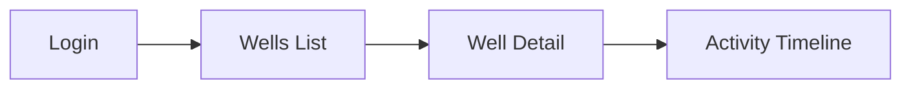

# Component-Driven Integration

How Pathfinder integrates with component-driven frontend development.

## The Three Layers

```
┌─────────────────────────────────────────────────────────┐
│                    USER JOURNEY                         │
│            (What the user experiences)                  │
├─────────────────────────────────────────────────────────┤
│                                                         │
│   ┌─────────────┐   ┌─────────────┐   ┌─────────────┐  │
│   │   Screen    │ → │   Screen    │ → │   Screen    │  │
│   │   (Login)   │   │  (WellList) │   │  (Activity) │  │
│   └──────┬──────┘   └──────┬──────┘   └──────┬──────┘  │
│          │                 │                 │          │
│   ┌──────┴──────┐   ┌──────┴──────┐   ┌──────┴──────┐  │
│   │ Components  │   │ Components  │   │ Components  │  │
│   │ • Input     │   │ • WellCard  │   │ • Timeline  │  │
│   │ • Button    │   │ • SearchBar │   │ • StatusBadge│ │
│   └─────────────┘   └─────────────┘   └─────────────┘  │
│                                                         │
│                    GLUE (routing, state, API calls)     │
└─────────────────────────────────────────────────────────┘
```

## Development Flow

### Traditional (Bottom-Up Only)
```
Components → Screens → Glue → "Hope it works"
```

### Pathfinder (Top-Down Tests, Bottom-Up Build)
```
1. Define Journey (Trail Map)
2. Write E2E Test (Scout)           ← Top-down
3. Test fails (❌ Uncharted)
4. Build Components (if needed)     ← Bottom-up  
5. Compose Screens
6. Wire Glue
7. Test passes (✅ Blazed)
```

## Test Pyramid for Component-Driven Development

```
        △ E2E Tests (Journey)
       ╱ ╲   • Full user flow
      ╱   ╲  • Scout writes FIRST
     ╱─────╲ • Validates glue works
    ╱ Screen ╲
   ╱  Tests   ╲  • Screen renders correctly
  ╱           ╲  • Components compose properly
 ╱─────────────╲
╱  Component    ╲
╱    Tests       ╲ • Unit tests for design system
╱                 ╲ • Props, states, interactions
───────────────────
```

## Practical Workflow

### Step 1: Scout Defines the Journey

In `USER-JOURNEYS.md`:


### Step 2: Scout Writes E2E Test

```typescript
// e2e/journeys/activity-timeline.spec.ts
test('user can view activity timeline', async ({ page }) => {
  // JOURNEY: Login → Wells → Well Detail → Activity
  await page.goto('/login');
  await page.fill('[data-testid="email"]', user.email);
  await page.fill('[data-testid="password"]', user.password);
  await page.click('[data-testid="login-button"]');
  
  // Navigate to wells
  await expect(page.locator('[data-testid="wells-list"]')).toBeVisible();
  await page.click('[data-testid="well-card"]').first();
  
  // Check activity timeline
  await expect(page.locator('[data-testid="activity-timeline"]')).toBeVisible();
  await expect(page.locator('[data-testid="activity-item"]')).toHaveCount.greaterThan(0);
});
```

Test fails → Trail Marker: ❌ → 🔄

### Step 3: Builder Checks Design System

**Questions to ask:**
1. Do we have an `ActivityTimeline` component? → No
2. Do we have an `ActivityItem` component? → No
3. Do we have a `StatusBadge` component? → Yes ✓

**Decision:** Create `ActivityTimeline` and `ActivityItem` components.

### Step 4: Builder Creates Components

```typescript
// components/ActivityTimeline/ActivityTimeline.tsx
interface ActivityTimelineProps {
  activities: Activity[];
  onActivityClick?: (activity: Activity) => void;
}

export function ActivityTimeline({ activities, onActivityClick }: ActivityTimelineProps) {
  return (
    <div data-testid="activity-timeline" className="activity-timeline">
      {activities.map(activity => (
        <ActivityItem 
          key={activity.id}
          activity={activity}
          onClick={() => onActivityClick?.(activity)}
        />
      ))}
    </div>
  );
}
```

```typescript
// components/ActivityItem/ActivityItem.tsx
export function ActivityItem({ activity, onClick }: ActivityItemProps) {
  return (
    <div data-testid="activity-item" className="activity-item" onClick={onClick}>
      <StatusBadge status={activity.status} />
      <span>{activity.name}</span>
      <span>{activity.duration}</span>
    </div>
  );
}
```

### Step 5: Builder Composes Screen

```typescript
// screens/WellDetail/WellDetail.tsx
import { ActivityTimeline } from '@/components/ActivityTimeline';

export function WellDetailScreen() {
  const { wellId } = useParams();
  const { data: activities } = useActivities(wellId);
  
  return (
    <div data-testid="well-detail">
      <WellHeader wellId={wellId} />
      <Tabs>
        <Tab label="Activity">
          <ActivityTimeline activities={activities} />
        </Tab>
        <Tab label="Reports">
          <ReportsList wellId={wellId} />
        </Tab>
      </Tabs>
    </div>
  );
}
```

### Step 6: Builder Wires Glue

```typescript
// routes.tsx
<Route path="/wells/:wellId" element={<WellDetailScreen />} />

// hooks/useActivities.ts
export function useActivities(wellId: string) {
  return useQuery(['activities', wellId], () => 
    api.get(`/wells/${wellId}/activities`)
  );
}
```

### Step 7: Test Passes

```bash
$ pnpm test:e2e e2e/journeys/activity-timeline.spec.ts

✓ user can view activity timeline (2.3s)

1 passed
```

Trail Marker: 🔄 → ✅

## Component Test Examples

While Scout focuses on E2E, Builder can add component tests for the design system:

```typescript
// components/ActivityTimeline/ActivityTimeline.test.tsx
describe('ActivityTimeline', () => {
  it('renders empty state when no activities', () => {
    render(<ActivityTimeline activities={[]} />);
    expect(screen.getByText('No activities')).toBeInTheDocument();
  });

  it('renders activity items', () => {
    const activities = [mockActivity({ name: 'Drilling' })];
    render(<ActivityTimeline activities={activities} />);
    expect(screen.getByText('Drilling')).toBeInTheDocument();
  });

  it('calls onActivityClick when item clicked', () => {
    const onClick = vi.fn();
    const activities = [mockActivity()];
    render(<ActivityTimeline activities={activities} onActivityClick={onClick} />);
    fireEvent.click(screen.getByTestId('activity-item'));
    expect(onClick).toHaveBeenCalledWith(activities[0]);
  });
});
```

## Data-TestId Convention

Use consistent `data-testid` attributes for reliable E2E tests:

| Layer | Pattern | Example |
|-------|---------|---------|
| Component | `{component-name}` | `data-testid="activity-timeline"` |
| Component part | `{component}-{part}` | `data-testid="activity-item"` |
| Screen | `{screen}-screen` | `data-testid="well-detail-screen"` |
| Action | `{action}-button` | `data-testid="login-button"` |
| Form field | `{field}-input` | `data-testid="email-input"` |

## Summary

| Phase | Actor | Focus | Direction |
|-------|-------|-------|-----------|
| 1. Define Journey | Scout | Trail Map | Top-down |
| 2. Write E2E Test | Scout | User flow | Top-down |
| 3. Check Design System | Builder | Inventory | — |
| 4. Create Components | Builder | Design system | Bottom-up |
| 5. Compose Screens | Builder | Composition | Bottom-up |
| 6. Wire Glue | Builder | Integration | Bottom-up |
| 7. Verify | Both | Test passes | — |

The journey test is the **acceptance criteria**. Build whatever you need to make it pass.
