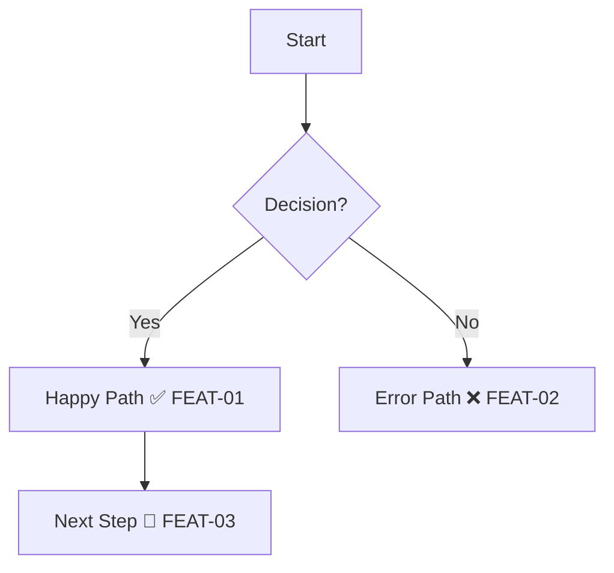

# Trail Map Format

Standard format for `USER-JOURNEYS.md` — the expedition's master map.

## File Location

```
project/
└── docs/
    └── test-coverage/
        └── USER-JOURNEYS.md   ← Master trail map
```

## Structure

```markdown
# 🗺️ Trail Map — User Journeys

## Coverage Summary
| Journey | Coverage | Checkpoints | Last Scouted |
|---------|----------|-------------|--------------|
| Auth    | 56%      | 5/9         | 2026-02-08   |

## [Journey Name]

### Trail Map
[Mermaid diagram with markers]

### Checkpoints
[Table with status]
```

## Mermaid Diagram Format

Embed checkpoint IDs and markers directly in nodes:



**Node format:** `[Description MARKER ID]`
- `[Login Success ✅ AUTH-01]`
- `[Error Message ❌ AUTH-02]`
- `[Loading State 🔄 AUTH-03]`

## Checkpoint Table Format

```markdown
| ID | Checkpoint | Category | Status | Last Run |
|----|------------|----------|--------|----------|
| AUTH-01 | Login redirects | Happy Path | ✅ | 2026-02-08 |
| AUTH-02 | Invalid password | Error | ❌ | - |
```

**Columns:**
- **ID:** Unique identifier (`{JOURNEY}-{NUMBER}`)
- **Checkpoint:** What is being tested
- **Category:** Happy Path, Error, Edge Case, Empty State
- **Status:** Trail marker
- **Last Run:** Date of last test execution

## Trail Markers

| Marker | Name | Meaning | When Used |
|--------|------|---------|-----------|
| ❌ | Uncharted | Checkpoint identified, not tested | Scout identified test case |
| 🔄 | Scouted | Test written, not passing | Scout wrote test, awaiting builder |
| ✅ | Cleared | Test passing | Builder made test pass |
| ⚠️ | Unstable | Flaky test | Intermittent failures |
| ⏭️ | Skipped | Intentionally not tested | Out of scope or blocked |

## Checkpoint Naming

**Format:** `{JOURNEY}-{NUMBER}`

**Examples:**
- `AUTH-01`, `AUTH-02` — Authentication journey
- `DASH-01`, `DASH-02` — Dashboard journey
- `WELL-01`, `WELL-02` — Wells journey

**Rules:**
- Always uppercase
- Numbers are zero-padded for sorting (`01` not `1`)
- Journey prefix matches section name

## Categories

Organize checkpoints by type:

| Category | Description | Example |
|----------|-------------|---------|
| Happy Path | Normal user flow | "Login succeeds" |
| Error | Error handling | "Invalid password shows message" |
| Edge Case | Boundary conditions | "Empty list shows message" |
| Empty State | No data scenarios | "No wells displays prompt" |
| Hazard | Security/performance | "SQL injection prevented" |

## Coverage Calculation

```
Coverage = (✅ Cleared) / (Total Checkpoints) × 100
```

**Counts toward total:**
- ❌ Uncharted (0 points)
- 🔄 Scouted (0 points)  
- ✅ Cleared (1 point)
- ⚠️ Unstable (0.5 points)
- ⏭️ Skipped (excluded from total)

## Auto-Update

Use the coverage script to sync test results:

```bash
# From test results file
npx tsx scripts/update-coverage.ts --results /tmp/test-results.json

# Manual update
npx tsx scripts/update-coverage.ts --status AUTH-01:pass,AUTH-02:fail

# Auto-detect latest results
npx tsx scripts/update-coverage.ts
```

## Expedition History

Track all scouting missions:

```markdown
## Expedition History

| Date | Scout | Expedition | Checkpoints Cleared |
|------|-------|------------|---------------------|
| 2026-02-08 | Henry | Dashboard feature | DASH-01 through DASH-08 |
| 2026-02-07 | Henry | Auth flow | AUTH-01 through AUTH-05 |
```
