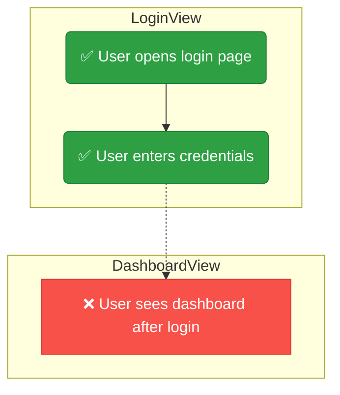

# Blazing

Transform the journey map into visual Mermaid diagrams that show exactly what's tested and what's not.

## Process

1. **Read journey map:** Load `<testDir>/pathfinder/journeys.json`
2. **Generate diagrams:** Run `python3 scripts/generate-diagrams.py <testDir>/pathfinder/journeys.json`

This creates `<testDir>/pathfinder/blazes.md` with multiple diagram types:

### Legend
A table at the top explains all symbols, colours, and arrow types used:

| Symbol | Meaning |
|--------|---------|
| 🟢 ✅ | **Tested** — step has a passing UI test |
| 🟡 ⚠️ | **Partial** — test written but disabled or implicitly covered |
| 🔴 ❌ | **Untested** — no UI test coverage |
| 🔵 🔀 | **Decision point** — user chooses between paths |
| ⚡ | **Error path** — API failure branch |
| `──▶` | Same-screen transition |
| `╌╌▶` | Cross-screen navigation |

### Combined Decision Tree
All journeys merged into one flowchart showing every branching path:
- Diamond `{{"🔀"}}` nodes at decision points where the user chooses
- Shared prefixes merged (e.g., if two journeys start at the same screen)
- Error paths branch from loading/API steps with dashed `⚡ API Error` arrows
- Spot coverage gaps at a glance in the full tree

### Per-Journey Flowcharts
One Mermaid `flowchart TD` per journey with colour-coded nodes:



**Node shapes by status:**
| Status | Shape | Colour |
|--------|-------|--------|
| Tested | `("label")` rounded | 🟢 `#2ea043` green |
| Partial | `[/"label"/]` parallelogram | 🟡 `#d29922` amber |
| Untested | `["label"]` rectangle | 🔴 `#f85149` red |
| Decision | `{{"label"}}` diamond | 🔵 `#1f6feb` blue |

**Arrow types:**
| Type | When used |
|------|-----------|
| `-->` solid | Steps on the same screen |
| `-.->` dashed | Navigation across screens |
| `-.->|"⚡ API Error"|` labelled dashed | Error branch from API/loading step |

### Coverage Summary Table
```
| Journey | Steps | Tested | Coverage |
|---------|-------|--------|----------|
| 🔐 Auth | 5 | 3 | 60% |
```

### Before/After Comparison (automatic)
On first run, a baseline is auto-saved to `<testDir>/pathfinder/journeys-baseline.json`.
On subsequent runs, if coverage has changed, the output includes:

- **📸 Before (Baseline)** — decision tree at baseline coverage
- **🚀 After (Current)** — decision tree with current coverage
- **📊 Coverage Delta** — summary table with per-journey step deltas

```
| Metric | Before | After | Delta |
|--------|--------|-------|-------|
| Steps tested | 14/25 | 16/25 | +2 |
| Coverage | 56.0% | 64.0% | +8.0% |

| Journey | Before | After | Delta |
|---------|--------|-------|-------|
| 🔐 Auth | 60.0% | 80.0% | +1 steps |
```

## Baseline Management

| Command | What it does |
|---------|-------------|
| `python3 scripts/generate-diagrams.py journeys.json` | Normal run; auto-creates baseline on first run |
| `python3 scripts/generate-diagrams.py journeys.json --save-baseline` | Reset baseline to current coverage |
| `python3 scripts/generate-diagrams.py journeys.json --clear-baseline` | Remove baseline; next run creates a fresh one |

Use `--save-baseline` after completing a coverage sprint to reset the "before" snapshot for the next round.

3. **Commit:** `git add <testDir>/pathfinder/blazes.md && git commit -m "Diagram: N journeys mapped (X% coverage)"`

## Updating After Tests

After writing tests in the scout phase, re-run:
```bash
python3 scripts/generate-diagrams.py <testDir>/pathfinder/journeys.json
```

The diagram updates ❌ → ✅ for newly tested steps, and the before/after comparison shows progress.

## Mermaid Syntax Notes

- Parentheses `()` in labels are auto-escaped to `[]` to avoid Mermaid shape conflicts
- All labels are wrapped in double quotes for safety
- If you encounter parse errors, check for unescaped special characters in step action text

## Error Handling

- If `journeys.json` is missing, invoke `/map` first.
- If a journey has 0 steps, it was mapped incorrectly — go back and re-examine that flow.
- If Mermaid parse errors occur, re-run the generator — it sanitizes labels automatically.
