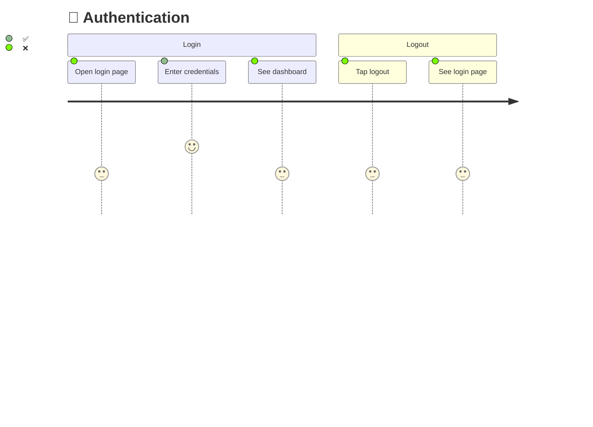

# Blazing

Transform the journey map into visual Mermaid diagrams that show exactly what's tested and what's not.

## Process

1. **Read journey map:** Load `.pathfinder/journeys.json`
2. **Generate diagrams:** Run `python3 skills/blazing/scripts/generate-diagrams.py .pathfinder/journeys.json`

This creates `.pathfinder/blazes.md` with one Mermaid journey diagram per journey:



**Score key:** `5: ✅` = tested, `3: ❌` = not tested, `4: ⚠️` = partial coverage

3. **Generate coverage summary:**
```
## Coverage: 12/47 steps tested (25.5%)

| Journey | Steps | Tested | Coverage |
|---------|-------|--------|----------|
| 🔐 Auth | 5 | 1 | 20% |
| 📊 Dashboard | 8 | 3 | 37.5% |
| 📄 Reports | 12 | 0 | 0% |
```

4. **Commit:** `git add .pathfinder/blazes.md && git commit -m "Diagram: N journeys mapped (X% coverage)"`

## Updating After Tests

After writing tests in the scout phase, re-run:
```bash
python3 skills/blazing/scripts/generate-diagrams.py .pathfinder/journeys.json
```

The diagram updates ❌ → ✅ for newly tested steps.

## Error Handling

- If `journeys.json` is missing, invoke `pathfinder:mapping` first.
- If a journey has 0 steps, it was mapped incorrectly — go back and re-examine that flow.
