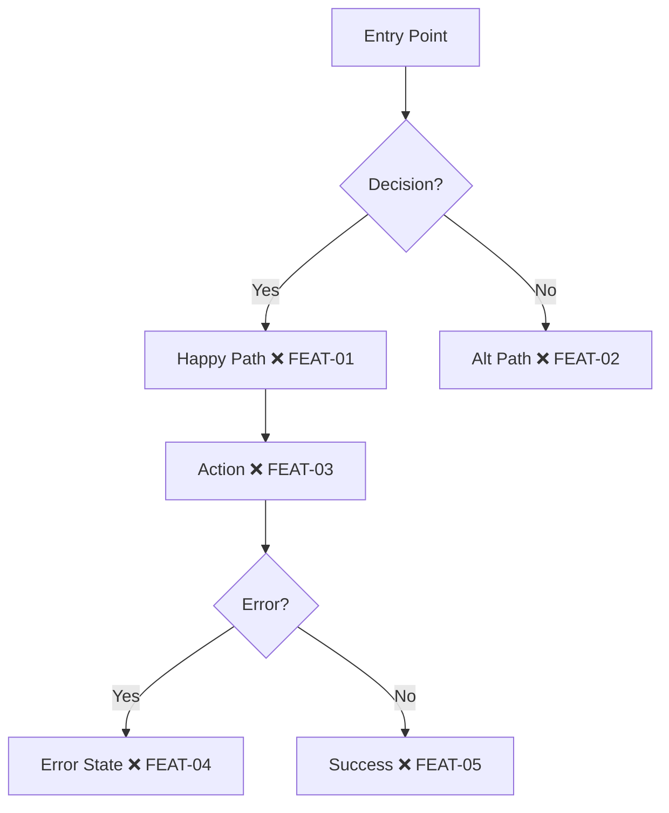

# Charting — Phase 2

**Goal:** Create visual journey diagram with all checkpoints marked.

**Prerequisite:** Survey approved (Phase 1 complete).

## Create Mermaid Diagram

Create or update `USER-JOURNEYS.md`:

## Node Format

**Pattern:** `[Description MARKER ID]`

- `[Dashboard ❌ AUTH-01]` — Uncharted checkpoint
- `{Valid Credentials?}` — Decision node (no checkpoint)
- `[Login Page]` — Navigation node (no checkpoint)

## Checkpoint Naming

**Format:** `{JOURNEY}-{NUMBER}`

- `AUTH-01`, `AUTH-02` — Authentication journey
- `DASH-01`, `DASH-02` — Dashboard journey
- `WELL-01`, `WELL-02` — Wells journey

Always uppercase, zero-padded.

## Present in Sections

Don't dump the entire diagram at once. Present in sections:

1. Show the happy path first
2. Add error paths
3. Add edge cases
4. Check after each: "Does this look right so far?"

## YAGNI Check

Before finalizing: "Can any of these checkpoints be removed?"
Every checkpoint is a test that must be written and maintained.
