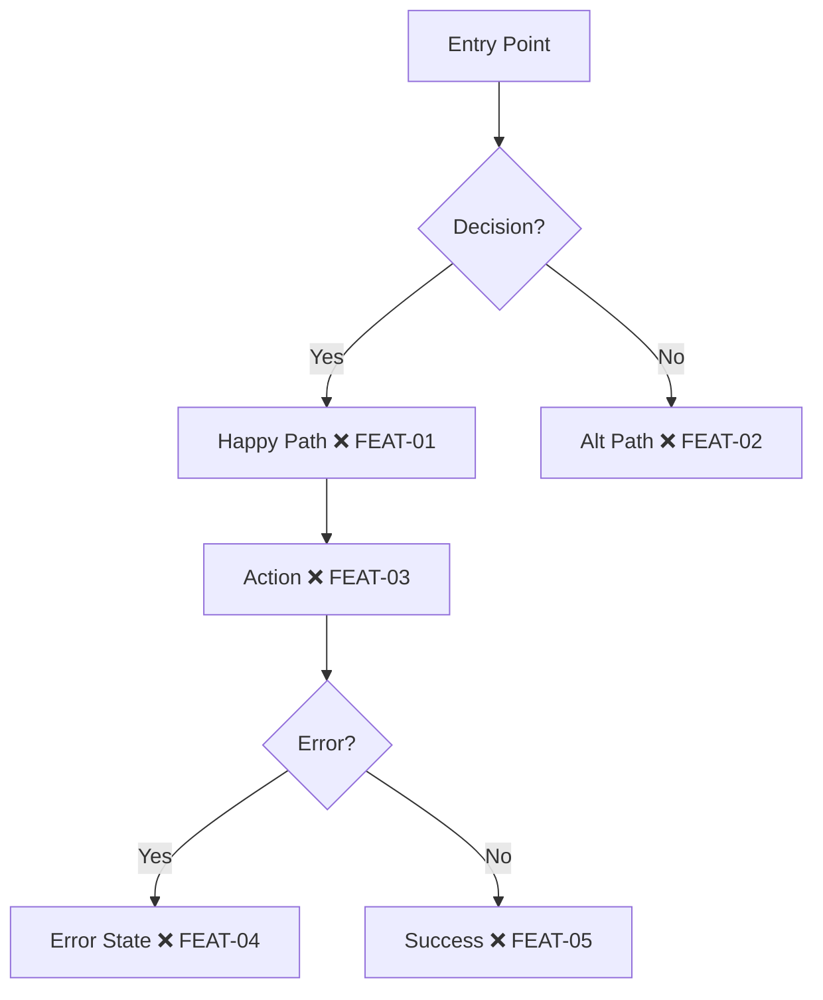

# Planning — Phase 2

**Goal:** Create a visual journey map and extract all checkpoints in one pass.

**Prerequisite:** Survey approved (Phase 1 complete).

## Gate Check (Mandatory)

Before doing ANYTHING in this phase:

```bash
cat .pathfinder/survey.json
```

If this file doesn't exist or `status` is not `"approved"` → **STOP. Run the Survey phase first.**
Do not proceed. Do not create the file retroactively. Go back to Phase 1.

## Create the Trail Map

Create or update `USER-JOURNEYS.md` with a Mermaid diagram:



**Node format:** `[Description MARKER ID]`

**Checkpoint naming:** `{JOURNEY}-{NUMBER}` — uppercase, zero-padded.
- `AUTH-01`, `AUTH-02` — Authentication journey
- `DASH-01`, `DASH-02` — Dashboard journey

## Present Incrementally

1. Show the happy path first
2. Add error paths
3. Add edge cases
4. Check after each: "Does this look right so far?"

## Extract Checkpoints

For each checkpoint in the diagram, define:

| ID | Category | Description | Priority |
|----|----------|-------------|----------|
| FEAT-01 | Happy Path | Main flow works | Must have |
| FEAT-02 | Error | Error state handled | Must have |
| FEAT-03 | Empty State | No data message shown | Must have |
| FEAT-04 | Edge Case | Boundary handled | Should have |
| FEAT-05 | Validation | Input validated | Should have |

### Categories

| Category | Priority |
|----------|----------|
| Happy Path | Must have |
| Error | Must have |
| Empty State | Must have |
| Action | Must have |
| Edge Case | Should have |
| Validation | Should have |
| Loading | Should have |

### Edge Case Matrix

| Scenario | Expected | Checkpoint |
|----------|----------|------------|
| No data | Empty state message | FEAT-03 |
| API timeout | Retry + error | FEAT-04 |
| Invalid input | Validation message | FEAT-05 |

## YAGNI Check

Before finalizing: "Can any of these checkpoints be removed?"
Every checkpoint is a test that must be written and maintained. Strip what isn't essential.

## Gate File + Commit Before Scouting

Save map, checkpoints, AND gate file BEFORE writing any tests:

```bash
mkdir -p .pathfinder
cat > .pathfinder/plan.json << 'EOF'
{
  "phase": "plan",
  "status": "approved",
  "timestamp": "<ISO-8601>",
  "journey": "<journey-name>",
  "checkpoints": [
    {"id": "FEAT-01", "category": "Happy Path", "description": "<desc>", "priority": "must"},
    {"id": "FEAT-02", "category": "Error", "description": "<desc>", "priority": "must"}
  ],
  "approvedBy": "user"
}
EOF
git add USER-JOURNEYS.md .pathfinder/plan.json
git commit -m "Plan: Chart map for FEAT-01 through FEAT-05"
```

**The Scouting phase will refuse to proceed without `.pathfinder/plan.json`.**

## Anti-Rationalization

| Rationalization | Counter |
|----------------|---------|
| "The requirements are clear, skip the diagram" | Diagrams expose gaps that text hides. Draw it. |
| "I'll figure out the checkpoints as I go" | Ad-hoc checkpoints miss edge cases. Plan them now. |
| "This is too small for a map" | Small features have hidden complexity. A 5-node map takes 2 minutes. |
