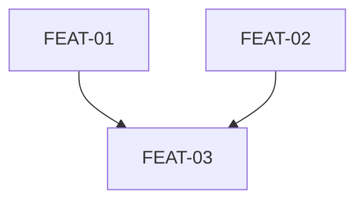

# Planning

<HARD-GATE>
Requires `.pathfinder/state.json` with `phases.survey.status === "approved"`. If not, invoke surveying first.
</HARD-GATE>

## Process

1. **Break work into bite-sized tasks** (2-5 minutes each). Each task must have:
   - Exact file paths
   - Complete code approach
   - Verification steps (which tests to write/run)

2. **Save the plan** to `docs/plans/YYYY-MM-DD-<expedition-name>.md`

3. **Create task files** — one per checkpoint in `.pathfinder/tasks/`:

```bash
mkdir -p .pathfinder/tasks
```

Each `.pathfinder/tasks/<PREFIX>-XX.json`:
```json
{
  "id": "FEAT-01",
  "description": "What this checkpoint verifies",
  "category": "Happy Path|Error Handling|Edge Case|Integration",
  "priority": "must|should|could",
  "status": "planned",
  "dependencies": [],
  "tests": { "e2e": [], "unit": [] },
  "evidence": { "red": null, "green": null, "verified": null },
  "builderNotes": ""
}
```

Use expedition-specific prefixes (e.g. `WDASH-01`, `REF-01`). Dependencies are task IDs that must be green before this one can start.

4. **Validate tasks:** Run `python3 scripts/validate-tasks.py .pathfinder/tasks` — fix any errors.

5. **Create plan gate** (`.pathfinder/plan.json`):
```json
{
  "status": "approved",
  "timestamp": "<ISO-8601>",
  "expedition": "<name>",
  "planFile": "docs/plans/YYYY-MM-DD-<name>.md",
  "checkpoints": [{ "id": "FEAT-01", "description": "...", "dependencies": [] }]
}
```

6. **Update state:** Set `currentPhase: "plan"`, `phases.plan.status: "approved"`, update checkpoint counts.

7. **Present dependency graph** as Mermaid:


8. **Commit:** `git add .pathfinder/ docs/plans/ && git commit -m "Plan: <name> (N checkpoints)"`

## Error Handling

- If circular dependencies detected, restructure tasks to break cycles.
- If >20 checkpoints, consider splitting into multiple expeditions.
- If validation fails, fix reported issues before committing.

## Output

- `docs/plans/YYYY-MM-DD-<name>.md` — human-readable plan
- `.pathfinder/plan.json` — gate file
- `.pathfinder/tasks/*.json` — one per checkpoint
