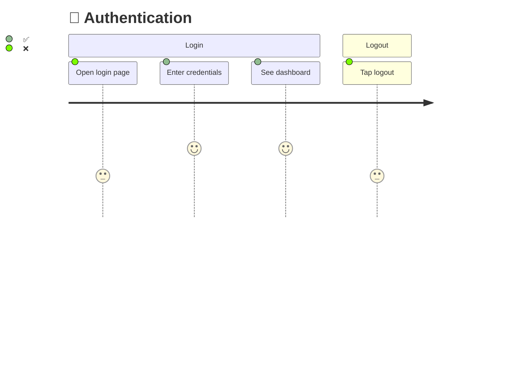

# Using Pathfinder

Pathfinder discovers every user journey in your codebase, shows what's tested vs not with Mermaid diagrams, then generates the missing UI tests.

## Quick Start

```bash
python3 scripts/pathfinder-init.py
```

## Workflow

```
/map → /diagram → /scout → /verify
```

| Phase | Skill | What happens |
|-------|-------|-------------|
| Map | `pathfinder:mapping` | Deep dive into code, discover all user journeys |
| Diagram | `pathfinder:diagramming` | Generate Mermaid diagrams: ✅ tested, ❌ untested |
| Scout | `pathfinder:scouting` | Write UI tests for ❌ steps using `pathfinder:ui-testing` |
| Verify | `pathfinder:verifying` | Run tests, update diagrams ❌→✅, compute coverage |

## The Diagram Is the Source of Truth



Every time you write a test, the diagram updates. Coverage percentage goes up. Gaps become visible.

## Quick Reference

```bash
python3 scripts/pathfinder-init.py                                    # init
python3 skills/mapping/scripts/scan-test-coverage.py .                # scan existing tests
python3 skills/diagramming/scripts/generate-diagrams.py .pathfinder/journeys.json  # diagrams
python3 skills/ui-testing/scripts/generate-ui-test.py AUTH-01 "Login" playwright    # generate test
python3 scripts/coverage-score.py .pathfinder/journeys.json           # coverage score
```

## Error Handling

- No UI framework detected → specify manually or install one.
- Journey map missing → run `/map` first.
- Coverage drops → new code added untested routes. Re-run `/map`.
