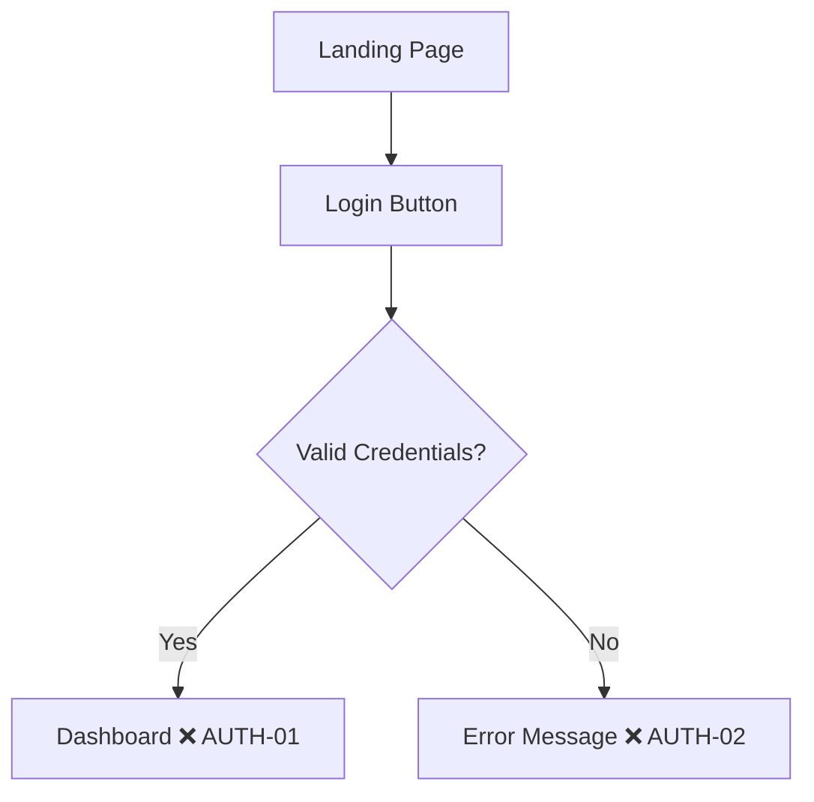

# Trail Map — User Journeys

*Last updated: YYYY-MM-DD*

## Coverage Summary

| Journey | Coverage | Checkpoints | Last Run |
|---------|----------|-------------|----------|
| AUTH | 0% | 0/0 | - |

**Total Coverage:** 0% (0/0 checkpoints cleared)

---

## AUTH Journey

### Trail Map

### Checkpoints

| ID | Checkpoint | Category | Status | Last Run |
|----|------------|----------|--------|----------|
| AUTH-01 | Login redirects to dashboard | Happy Path | ❌ | - |
| AUTH-02 | Invalid password shows error | Error | ❌ | - |

---

## Trail Markers Legend

| Marker | Meaning |
|--------|---------|
| ❌ | Uncharted — checkpoint identified, not tested |
| 🔄 | Scouted — test written, not yet passing |
| ✅ | Cleared — test passing |
| ⚠️ | Unstable — flaky test, needs investigation |
| ⏭️ | Skipped — intentionally not tested |

---

*Maintained by Pathfinder — Marks the trail before others follow.*
